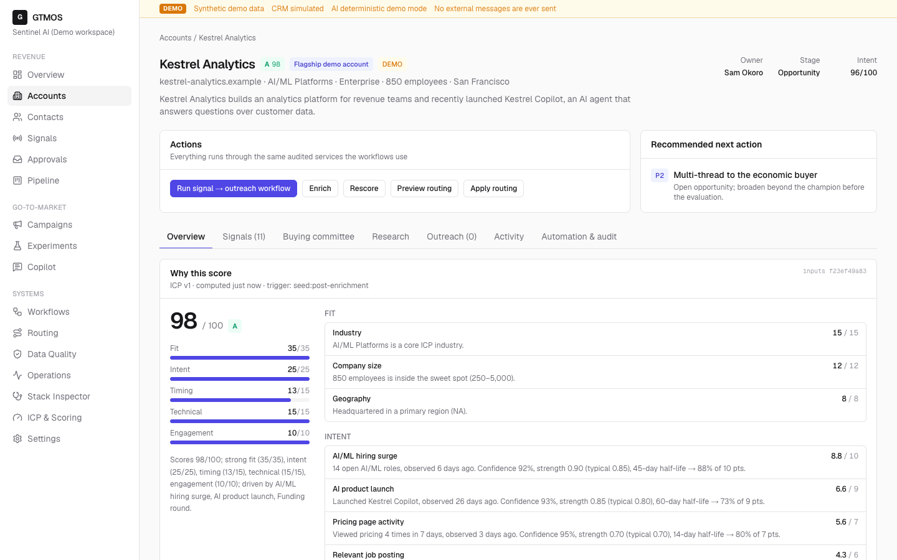
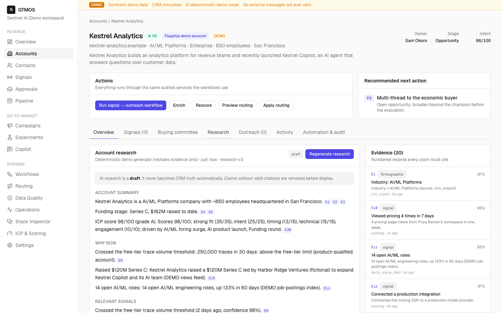
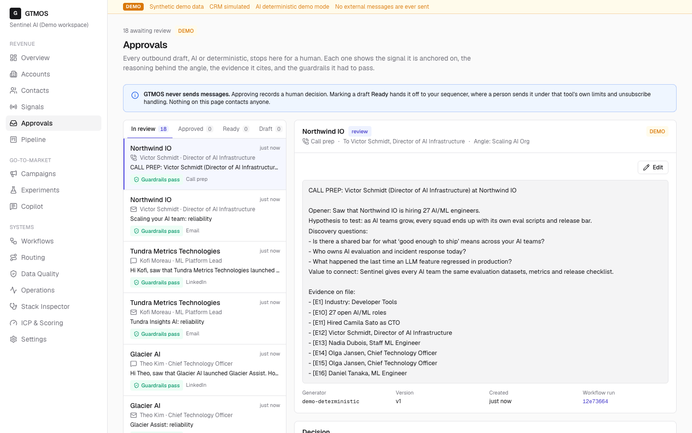
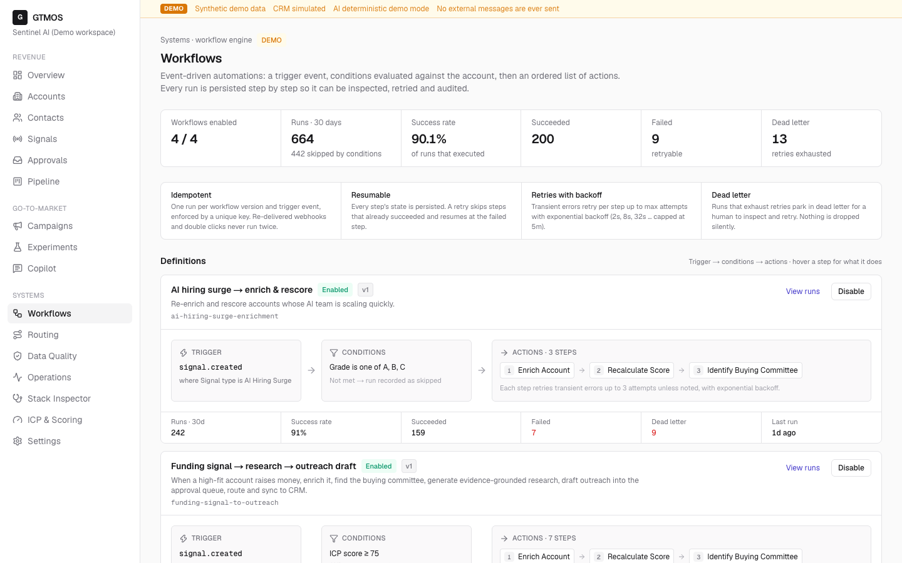
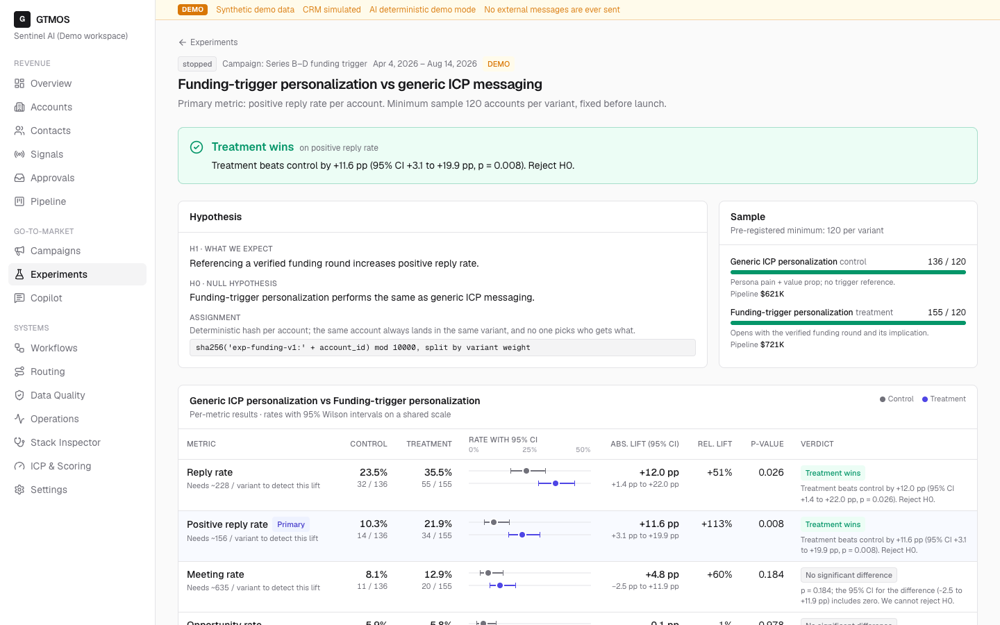
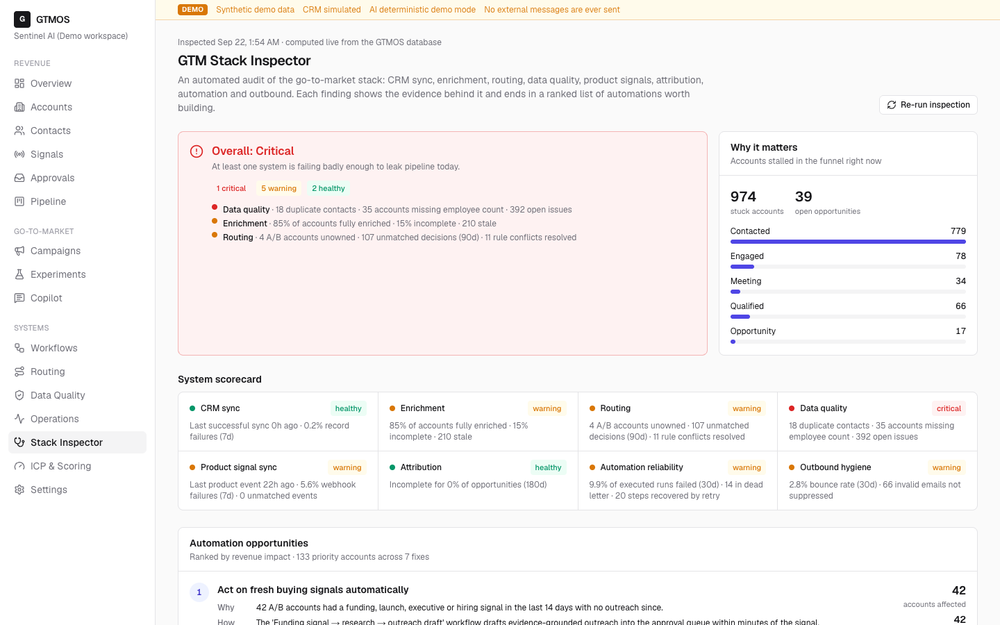
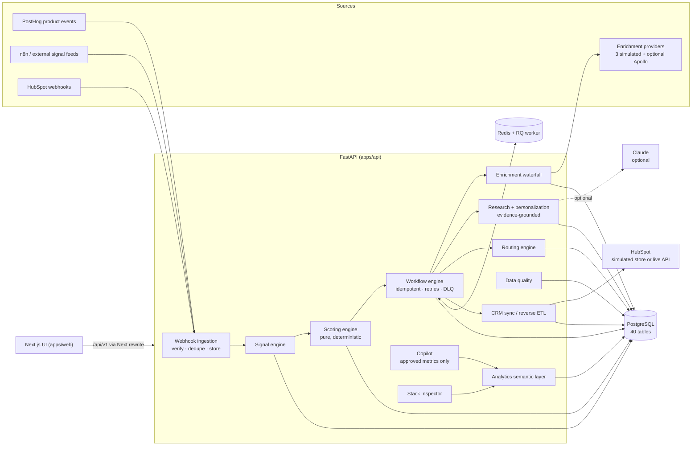

# GTMOS

**An AI-native revenue engine: it finds the accounts to sell to, explains why now, drafts evidence-grounded outreach for human approval, then routes, syncs and measures everything on deterministic, auditable infrastructure.**


> **Everything you see is DEMO data.** GTMOS ships with a deterministic, synthetic dataset for a fictional
> seller (*Sentinel AI*, reliability infrastructure for AI agents) and 2,000 fictional target accounts on
> reserved `.example` domains. Every integration runs in a clearly labeled **DEMO / SIMULATED** mode unless you
> configure credentials. GTMOS never sends email or LinkedIn messages.

---

## Why I built this

Modern GTM teams run on a patchwork: enrichment in Clay, scoring in a spreadsheet, routing in HubSpot
workflows, signals in five browser tabs, attribution in a BI tool nobody trusts, and "AI personalization" that
invents facts. The GTM Engineer's job is to turn that patchwork into **a system**: one where every account has
an explainable score, every signal becomes an action within minutes, every automation is idempotent and
observable, and AI accelerates reps without becoming an unreviewed source of CRM truth.

GTMOS is that system, built end to end: the data model, the deterministic engines, the integration boundaries
and the operating surfaces. It shows I can design, build and operate GTM infrastructure myself rather than only
configure SaaS tools.

## What it does

GTMOS runs the full loop:

```
TARGET → ENRICH → DETECT SIGNALS → SCORE → RESEARCH → IDENTIFY BUYERS → PERSONALIZE → APPROVE
       → ROUTE → SYNC CRM → TRACK ENGAGEMENT → CREATE OPPORTUNITY → MEASURE → EXPERIMENT → LEARN
```

| Question a GTM leader asks | Where GTMOS answers it |
|---|---|
| Which companies should we target? | **Accounts**: 2,000 accounts scored against a versioned ICP |
| Why are they a fit? | **Account page → Why this score**: every point traced to a rule and its evidence |
| Why contact them now? | **Signals**: funding, AI hiring, launches, exec hires and PLG events, with time decay |
| Who should we contact? | **Buying committee**: champion, economic buyer, evaluator, sponsor, user, each with reasons |
| What should we say? | **Research + Outreach**: cited research brief, guardrailed drafts, human approval queue |
| What happens next? | **Workflows + Routing**: trigger → conditions → actions, explainable routing with conflicts |
| What is happening in the funnel? | **Overview / Pipeline**: funnel, velocity, stuck accounts, attribution |
| Which experiments work? | **Experiments**: deterministic assignment, Wilson CIs, z-test, no premature winners |
| Where is pipeline leaking? | **Copilot + Stack Inspector**: approved analyses, ranked fixes with evidence |
| Is the GTM stack healthy? | **Stack Inspector / Operations / Data Quality** |

### Highlights

- **Explainable scoring.** Fit 35 · Intent 25 · Timing 15 · Technical 15 · Engagement 10. Signals decay by
  half-life, exclusions produce grade X, and the input hash makes every score reproducible.
- **Clay-style enrichment waterfall.** Per-field provider order, fallbacks on miss, error or low confidence,
  cost accounting, and field-level provenance. Manual locks are never overwritten.
- **Evidence-grounded AI.** Research claims must cite numbered evidence (E1..En) and uncited claims are
  stripped. Drafts follow *signal → pain → value → proof → CTA* and pass guardrails (no ungrounded numbers, no
  superlatives, verified signal, reachable contact) before they can be approved.
- **A real workflow engine.** Idempotency keys per trigger event, persisted step state, retries with backoff,
  dead letters, manual retry that resumes at the failed step, and inline or Redis/RQ execution.
- **Safe CRM integration.** A HubSpot adapter boundary that upserts on a custom unique property
  (`gtmos_account_id`, because HubSpot doesn't enforce `domain` uniqueness), batches of ≤100, 429/5xx retry,
  payload-hash change detection, and reverse ETL of computed properties.
- **Signed webhooks.** HMAC with a replay window (n8n and generic senders), token header (PostHog), HubSpot v3
  verification, dedupe on event id, replayable failures. Rejected deliveries can't poison idempotency keys.
- **Operating surfaces.** Data Quality (11 rules with audited remediation), Stack Inspector (health plus ranked
  automation opportunities, every number traceable), Operations (runs, syncs, webhooks, providers, correlation
  IDs), Audit log.
- **Safe Copilot.** Question → intent → *approved* metric function → deterministic numbers → explanation. No
  LLM-generated SQL, ever.

## Demo workflow

The fastest tour (≈10 minutes; full script in [`docs/demo-script.md`](docs/demo-script.md)):

1. **Overview**: the command center; note the DEMO banner and the "Act now" accounts.
2. **Accounts → Kestrel Analytics** (the flagship). A $120M Series C 12 days ago, a new VP of AI, an AI agent
   launch, 14 open AI roles, a champion already using the free product. **Why this score** shows every point.
3. **Buying committee → Research**: the committee's rationale, then a research brief where every sentence
   links to evidence.
4. **Run signal → outreach workflow**: enrich → rescore → committee → research → draft → route → CRM sync.
   The draft **multi-threads to the economic buyer** and references the engaged champion, because the account
   already has an open opportunity.
5. **Approvals**: guardrails, reasoning chain and evidence. Approve, or watch a fabricated metric get blocked.
6. **Workflows → run detail**: step timeline, attempts, idempotency key and correlation id.
7. **Routing → simulator**: see a high-intent enterprise account beat the territory rule and why.
8. **Experiments**: funding-trigger personalization beat generic messaging on positive replies (+11.6 pp,
   p = 0.008). Meetings and opportunities are *not* significant yet, and the page says so.
9. **Data Quality → Stack Inspector → Copilot → Operations**: the system inspecting itself.

| | |
|---|---|
|  |  |
|  |  |
|  |  |

## Architecture



- **Deterministic core, AI at the edges.** Scoring, routing, workflow conditions, experiment assignment and
  statistics, attribution, data quality and analytics are pure functions with unit tests. The LLM only writes
  prose from a supplied evidence pack, and its output is validated like any other generator's.
- **Postgres is the source of truth; Redis is delivery.** Workflow runs are rows first. They're enqueued
  *after commit*, and a sweeper re-enqueues anything stuck in `queued`.
- **Every mutation is audited** with actor, before/after, reason and correlation id.

Details: [`docs/architecture.md`](docs/architecture.md) · [`docs/data-model.md`](docs/data-model.md) ·
[`docs/integrations.md`](docs/integrations.md) · [`docs/n8n.md`](docs/n8n.md).

## GTM concepts demonstrated

| Concept | In GTMOS |
|---|---|
| **ICP** | Versioned, validated definition (industries, size bands, regions, technographics, personas, signal budgets, exclusions, weights); preview grade changes before saving |
| **Enrichment** | Waterfall per field across providers with fallbacks, confidence thresholds, cost, provenance and merge policy |
| **Signals** | 13 types across intent / timing / engagement, each with source, confidence, strength, evidence, dedupe key and half-life decay |
| **Scoring** | Explainable 100-point model; fit vs "why now" (intent index); A–D grades; exclusions |
| **Routing** | Priority → specificity → key conflict resolution, ownership respect, inactive-owner reassignment, least-loaded pools with capacity |
| **CRM** | Mini-CRM with funnel + deal stages, forward-only lifecycle, stage history, HubSpot object mapping |
| **Workflows** | Trigger → conditions → actions; idempotent, resumable, retryable, observable |
| **Outbound** | Campaigns → sequences → steps; sent/delivered/replied/positive/meeting/opportunity/won; opens explicitly untrusted |
| **Experimentation** | Account-level hash assignment, Wilson intervals, two-proportion z-test, Newcombe CI, minimum sample |
| **Attribution** | First, last, linear and U-shaped side by side; unattributed share reported |
| **Reverse ETL** | Computed properties (`gtmos_icp_score`, `gtmos_intent_score`, `gtmos_account_tier`, `gtmos_last_signal`, `gtmos_next_best_action`) pushed with change detection |
| **Data quality** | Duplicates, invalid emails, missing fields, stale enrichment, orphans, lifecycle conflicts, missing owners, invalid transitions, bad external IDs |
| **Observability** | Workflow/sync/webhook health, provider hit and error rates, routing latency, correlation IDs, audit log |

A deeper explanation of each, with file references: [`docs/gtm-concepts.md`](docs/gtm-concepts.md).

## Integrations

| Integration | Status | Notes |
|---|---|---|
| HubSpot CRM | **DEMO** by default · **OPTIONAL LIVE** | Demo adapter writes a local simulated store and every sync is labeled SIMULATED. The real adapter (batch upsert, retries, custom properties) activates with `HUBSPOT_ACCESS_TOKEN` + `HUBSPOT_LIVE_WRITES_ENABLED=true`. It has **not** been exercised against a live portal. |
| PostHog | **DEMO** (seeded events) · live-ready ingestion | `POST /api/v1/webhooks/posthog` accepts PostHog-shaped events; `$groups.company` or email domain → account |
| n8n | **OPTIONAL** | 4 workflow templates in `integrations/n8n/`, verified to import into n8n 2.40.5 (`n8n import:workflow`). Not run against live external feeds. |
| Enrichment | **DEMO** (3 simulated providers) · **OPTIONAL** Apollo | Simulated providers answer from the deterministic universe with coverage, noise, cost and failures. Apollo adapter untested live. |
| Claude (LLM) | **DEMO** by default · **OPTIONAL LIVE** | Deterministic generators without configuration. Live research needs `ANTHROPIC_API_KEY` **and** `LLM_ENABLED=true`. |
| Email / LinkedIn sending | **Not implemented, by design** | "Ready" is the hand-off to a sequencer. |

## Running locally

**Prerequisites:** Docker, Python 3.13 + [uv](https://docs.astral.sh/uv/), Node 20+ (24 tested).

```bash
git clone <this repo> gtmos && cd gtmos
make setup          # uv sync + npm ci
make dev            # Postgres+Redis in Docker, migrate, seed (~1 min), API :8010 + web :3010
```

Open **http://localhost:3010**. API docs: **http://localhost:8010/docs**.

Or run everything in containers (API, worker, web, Postgres, Redis):

```bash
make up             # web http://localhost:3010 · API http://localhost:8010
```

Host ports are deliberately uncommon (Postgres **56432**, Redis **56379**) to avoid clashing with other local
services; override with `GTMOS_DB_PORT`, `GTMOS_REDIS_PORT`, `GTMOS_API_PORT`, `GTMOS_WEB_PORT`.

Useful commands: `make reset` (reload the demo dataset), `make n8n` (optional local n8n on :5678),
`make help` (all targets). Configuration: copy `.env.example` to `.env`; nothing in it is required.

## Testing

```bash
make test           # backend unit + integration (Postgres), frontend component tests
make lint typecheck # ruff + ruff format, ESLint, mypy --strict, tsc
make e2e            # Playwright smoke suite against a running stack (desktop + mobile)
make check          # everything above + production web build
```

| Suite | Count | What it covers |
|---|---|---|
| Backend unit (pytest) | 57 | Scoring, waterfall, routing conflicts, committee, experiments and attribution math, rules, pipeline transitions, matching, research citations, guardrails, live HubSpot/Apollo adapter contracts (mocked HTTP), webhook signatures |
| Backend integration (pytest + Postgres) | 67 | API contracts, signal → workflow → draft → CRM, idempotency, retries → dead letter → resume, signed webhooks and replay protection, PQL flow, reverse-ETL idempotency, data quality merges, copilot routing, admin-token gating |
| Frontend (Vitest + Testing Library) | 14 | Formatters, safe markdown (HTML injection), URL helpers, accessible meters, confirm-before-mutate, inline API errors |
| E2E (Playwright, production build) | 22 | Demo flow, every page renders without error boundaries, mobile has no horizontal scroll, mobile navigation |

Bugs found by these tests and fixed with regression tests include: a waterfall cache miss across positions, an
unsigned delivery blocking a later valid signed delivery (idempotency-key poisoning), Wilson interval float
residue, and evidence refs failing the numbers guardrail.

## Screenshots

`docs/screenshots/` is generated from the production build by `apps/web/scripts/screenshots.mjs`
(`node scripts/screenshots.mjs http://127.0.0.1:3011`).

## Design decisions

- **Deterministic first.** Anything that routes revenue or changes CRM state is a pure, tested function. LLMs
  write prose from evidence and never decide.
- **Human in the loop for every outbound word.** Drafts go DRAFT → REVIEW → APPROVED → READY; blocking guardrails
  prevent approval.
- **Idempotency everywhere.** Unique keys on signals, workflow runs, webhook events and external records;
  upserts on stable keys; payload hashing to skip unchanged syncs.
- **Honest data.** Seed data is synthetic and labeled. The simulated providers answer from the same
  deterministic universe, so enrichment fills real gaps instead of inventing values.
- **Understandable stack.** FastAPI + SQLAlchemy + Postgres + Redis/RQ + Next.js: boring on purpose, easy to
  explain, easy to run.

## Production considerations

- **Auth:** V1 runs as a single demo operator. Production needs SSO/OIDC, RBAC (rep vs RevOps vs admin),
  per-workspace isolation (the schema is already multi-tenant) and row-level authorization.
- **Scale:** move scoring to incremental recomputation on events, partition activities/engagements by time, add
  a proper job scheduler for nightly enrichment/DQ/reverse ETL, and put rate-limit budgets on providers.
- **Warehouse:** in a larger company GTMOS's analytics would read from a warehouse (dbt models), and reverse ETL
  would sync from there; the contract (keys, hashing, conflict policy) stays the same.
- **LLM operations:** prompt/version registry, offline evals on a golden set (citation validity, unsupported
  claim rate), cost budgets and caching.

## Limitations

- All data is synthetic. No real customers, results or revenue are represented.
- The real HubSpot and Apollo adapters are implemented against documented APIs but untested against live
  accounts; the live Claude path is implemented but disabled unless explicitly enabled.
- No email sending, no sequencer integration, no calendar integration.
- Single-tenant UI and demo-safe auth (see Production considerations).
- The workflow editor is definition-as-data with a read-only visual view, not a drag-and-drop builder.
- Some operational history (older workflow runs, sync runs, webhook events) is seeded synthetic history and
  is labeled as such in the UI. Recent runs were actually executed by the engine.

## Repository layout

```
apps/api        FastAPI service: models, domain (pure logic), services, integrations, seed, tests
apps/web        Next.js app: pages, UI primitives, charts, Vitest + Playwright tests
integrations/n8n  Importable n8n workflow templates
docs/           Research, spec, architecture, data model, concepts, integrations, demo script, interview prep
```

## Documentation

[Market research](docs/market-research.md) · [Product spec](docs/product-spec.md) ·
[Architecture](docs/architecture.md) · [Data model](docs/data-model.md) ·
[GTM concepts](docs/gtm-concepts.md) · [Integrations](docs/integrations.md) · [n8n](docs/n8n.md) ·
[Demo script](docs/demo-script.md) · [Interview guide](docs/interview-guide.md) ·
[Interview questions](docs/interview-questions.md) · [Resume bullets](docs/resume.md) ·
[Final review](docs/final-review.md)

## License

MIT. See [LICENSE](LICENSE).
