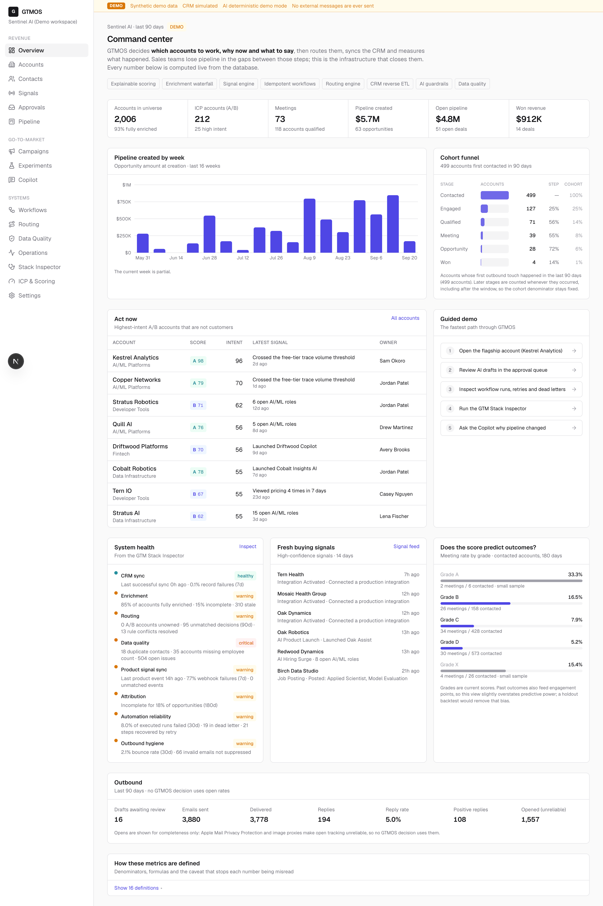
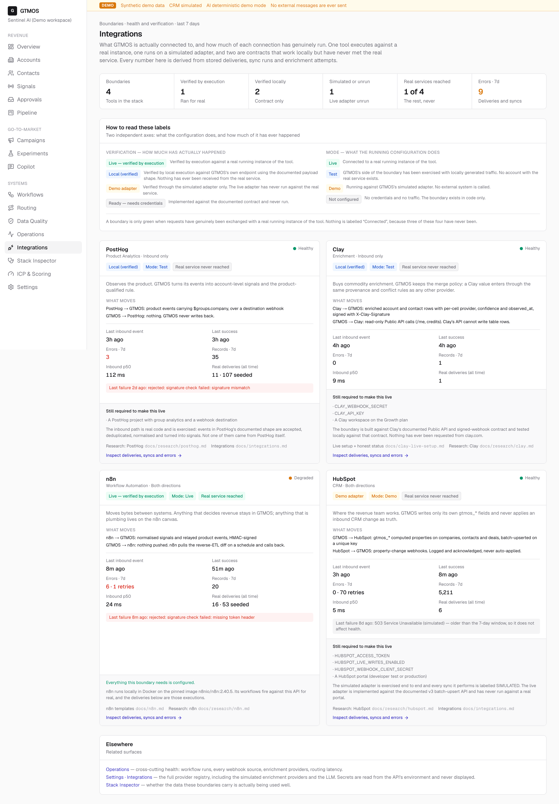
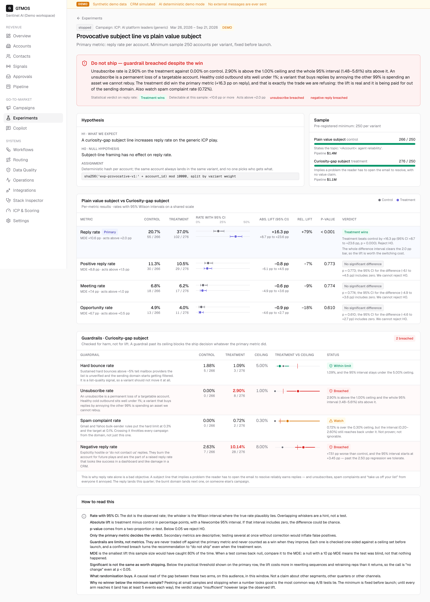
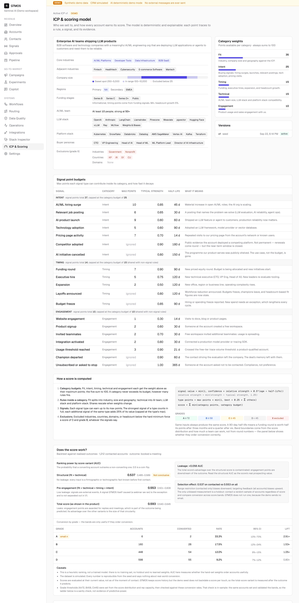
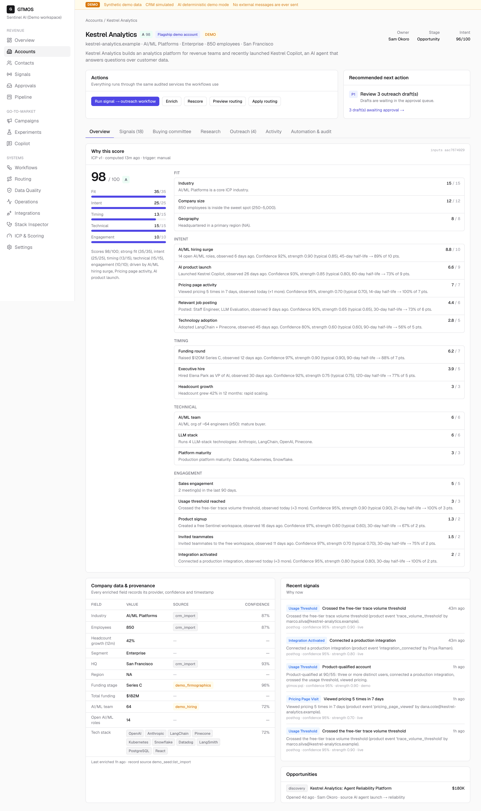
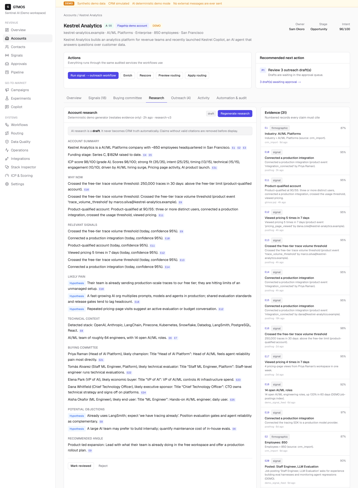
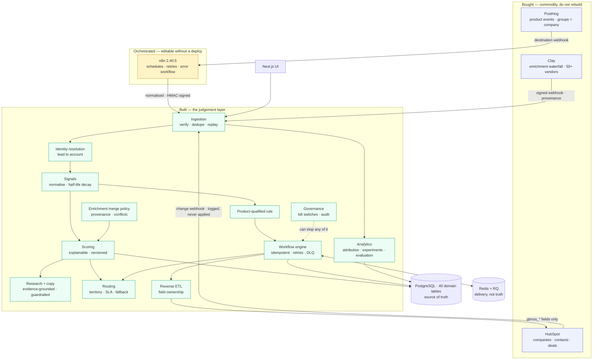

# GTMOS

**An AI-native GTM control plane: it connects product signals, enrichment, CRM state and custom decision
logic to work out which accounts deserve attention, why now, who owns them, and whether any of it worked.**



> **Everything here is DEMO data.** GTMOS ships with a deterministic, synthetic dataset for a fictional
> seller — *Sentinel AI*, reliability infrastructure for AI agents — and 2,006 fictional accounts on
> reserved `.example` domains. **It has never sent an email or a message to anyone**, and no paid model
> call was made building it. Each integration is labelled with exactly how far it has been verified,
> which for three of the four is "never talked to the vendor".

---

## The short version

Four things a longer read will confirm, put first so a skim does not have to wait for them.

**One of four integrations is verified by execution.** n8n runs locally in Docker on a pinned image and
its workflows genuinely fire against this API. HubSpot runs on a simulated adapter whose live half has
never touched a real portal. Clay and PostHog are contracts exercised locally against documented payload
shapes. The `/integrations` page says exactly that, in the product, and there is no "Connected" badge
anywhere — because three of the four have never been.

**The scoring model does not work yet, and this repository is the thing that says so.** Structural AUC
**0.537**, 95% interval 0.485–0.589 — not distinguishable from random on this data. The flattering,
leakage-contaminated variant scores 0.593, and [`docs/scoring-evaluation.md`](docs/scoring-evaluation.md)
explains why that is the wrong number to quote.

**The best-performing message is recommended against.** The seeded subject-line test lifts reply rate
+16.3 pp at p < 0.001, and the verdict is *do not ship*, because unsubscribes go 0.00% → 2.90%. Optimising
the primary metric alone is how a team burns its sending domain.

**The interesting part is the judgement, not the line count.** What to buy, what to orchestrate, what to
build, what a score is allowed to claim, and what the system should refuse to do — each written down with
its reasoning, so it can be argued with specifically.

If you have five minutes: open `/integrations`, then `/experiments/provocative-subject`, then
[`docs/scoring-evaluation.md`](docs/scoring-evaluation.md).

---

## Demo

Five screens, chosen because each one shows the system making a judgement you can check — not because
they show volume. Every figure is computed live from the database.

**It says how far each connection has actually got.** Two independent axes, mode and verification, and
no "Connected" badge anywhere, because three of these four have never reached the vendor.



**It rejects the message that won.** +16.3 pp on reply rate at p < 0.001, and the recommendation is
*do not ship*, because unsubscribes went from 0.00% to 2.90%.



**It grades its own model and publishes the bad number.** Leakage-free AUC 0.537 with an interval that
includes 0.5, reported ahead of the flattering 0.593, with the contamination explained.



**Every point traces to a rule.** 98 out of 100, decomposed across five categories, each line carrying
its evidence, confidence and half-life decay.



**Generated prose cites numbered evidence, and inferences are labelled as inferences.** A claim whose
citation does not resolve is removed before the brief is shown; the brief never becomes CRM truth.



The rest of the set — signals, pipeline, routing, workflows, data quality, the stack inspector,
operations, the approval queue and a mobile view — is in [`docs/screenshots.md`](docs/screenshots.md).

---

## The problem

A modern go-to-market team runs on four kinds of system, and none of them talks to the others.

| | Question it answers | Typical tool |
|---|---|---|
| Product analytics | What are users doing? | PostHog, Amplitude |
| Enrichment | Who is this company, really? | Clay, Apollo, Clearbit |
| Orchestration | How do these systems talk? | n8n, Zapier, Workato |
| CRM | Where does the revenue team work? | HubSpot, Salesforce |

Each is good at its job. What none of them owns is the **judgement layer**: what a signal actually means,
what an account is worth, who should work it, what may be said to them, and whether any of it worked.
That gap gets filled by a spreadsheet, a HubSpot workflow nobody can test, and a scoring formula whose
author has left. A GTM Engineer is hired to replace that with a system.

GTMOS is that system: the data model, the deterministic engines, the integration boundaries and the
operating surfaces.

## What it does

```
product signal → enrichment → scoring → routing → workflow → CRM → analytics
```

Concretely: a product event arrives and is matched to an account; enrichment fills in who that company
is, keeping per-field provenance; an explainable score says how good a fit they are and why *now*;
routing picks an owner against territories and SLAs; an idempotent workflow executes the steps; reverse
ETL pushes computed fields into the CRM without touching anything a rep owns; and the analytics layer
measures whether the whole thing produced pipeline — with the honesty to say when it cannot tell.

## The golden flow

One command drives a single account through every boundary in the system:

```bash
make golden-flow              # 20 steps, direct to the API
VIA_N8N=1 make golden-flow    # the same, routed through the real n8n container
```

Three people at one company use the product → PostHog-shaped events → n8n normalises and signs them →
GTMOS resolves the account, fires the product-qualified rule, moves the score, triggers a workflow and
routes an owner → reverse ETL pushes the company and associates its contacts → the CRM sends a change
webhook back → **the same webhook is delivered again and deduplicated** → analytics, Operations and the
audit log all reflect it.

It is deterministic and replayable. Both transports pass all twenty steps. Re-running it under the same
run key is *supposed* to collide with itself, and the harness reports that as the pass it is.

## Architecture



Two rules the diagram encodes. **Postgres is the source of truth and Redis is delivery** — workflow runs
are rows first, enqueued *after commit*, with a sweeper for anything stuck. And **the deterministic core
sits inside, AI at the edges** — scoring, routing, workflow conditions, experiment statistics, attribution
and data quality are pure functions with unit tests; a model only ever writes prose over an evidence pack
the system already holds.

Detail: [`docs/phase3-architecture.md`](docs/phase3-architecture.md) ·
[`docs/architecture.md`](docs/architecture.md) · [`docs/data-model.md`](docs/data-model.md).

## Engineering highlights

**1 · Explainable targeting.** A 100-point score across fit, intent, timing, technical and engagement,
computed as a pure deterministic function with a versioned ICP and a reproducible input hash. Every point
traces to a named rule and the evidence that triggered it, and signals decay on a half-life between 14
and 365 days, so a funding round stops counting long before an unsubscribe does. Six signal types
subtract.

**2 · Idempotent workflow execution.** Runs are rows with persisted step state, claimed with
`SELECT … FOR UPDATE SKIP LOCKED`, retried with bounded exponential backoff, dead-lettered on exhaustion
and resumable afterwards. The concurrency test uses two real database connections on two threads released
by a barrier, holds each step open to widen the race window, and asserts against three independent
oracles — because persisted step state alone does not prevent two workers reading the same `pending` rows.

**3 · CRM reconciliation and reverse ETL.** Batch upsert on a custom unique property, because HubSpot does
**not** deduplicate API-created companies on `domain`. Update payloads contain `gtmos_*` fields and nothing
else, so a sync cannot overwrite a rep's edit. Inbound changes are logged and never auto-applied, which is
how the sync loop is broken deliberately rather than by luck. Contacts and deals get **primary**
association types (1/5), not the general ones (279/341) — the distinction decides whether a record shows
up in territory reporting or behaves as an orphan.

**4 · GTM experimentation that can reject a winner.** Deterministic account-level assignment, Wilson
intervals, a minimum detectable effect on every result, and guardrail metrics (bounce, unsubscribe, spam,
negative reply) evaluated one-sided for harm. A guardrail breach outranks any win on the primary metric.

**5 · Evidence-grounded generation with a trust boundary.** Copy is written over a numbered evidence pack;
citations are validated, ungrounded numbers are blocked, and nothing can be approved while a blocking
guardrail fails. Untrusted text — enrichment values, signal titles, activity subjects — passes through a
sentence-level sanitiser at the boundary, which leaves a visible scar rather than silently editing
evidence.

**6 · Observability and honest evaluation.** Correlation ids on every run, sync, delivery and provider
call; an integrations surface whose green states are unreachable without execution; and evaluation
harnesses that grade the system's own output, report confidence intervals, and say plainly when a result
cannot support a claim.

## Integration philosophy

The failure mode of a project like this is rebuilding everything so the README can say it replaces a stack
of well-funded products. The interesting question is what to buy, what to orchestrate, and what to own.

**Buy PostHog** for event capture, person and group identity. B2B GTM is account-shaped, and PostHog's
group key is what turns a user event into an account fact. GTMOS does not store events or build funnels
over them. What it does not delegate is what the behaviour *means* — that lives in a product-qualified
rule with weights someone can argue with.

**Buy Clay** for enrichment. Clay's product is the *provider network*, not the waterfall; you can write a
waterfall in an afternoon, you cannot negotiate forty data contracts in one. GTMOS implements a waterfall
over three simulated providers purely to prove the mechanics, and keeps the part Clay does not do: the
**merge policy**. A Clay value enters through the same provenance and conflict rules as any other
provider and gets no special authority for having been bought.

**Orchestrate with n8n.** Anything that moves bytes between systems belongs on a canvas a RevOps person
can edit without a deploy. Anything that *decides revenue* belongs in version control with tests. A Slack
notification should not need a pull request; a scoring change should.

**Buy HubSpot** as the operational CRM. Reps live there. Rebuilding pipeline management, tasks, sequences
and permissions is how you end up owning a CRM and losing.

**Build the judgement layer.** The test for whether something belongs in GTMOS: *would a reasonable GTM
leader want to argue with it?* If yes, it has to be explainable, versioned and diffable — which means code
you own, not a vendor's black box or a workflow canvas.

Full comparison, including what each vendor charges for:
[`docs/phase3-tool-research.md`](docs/phase3-tool-research.md). Beginner-friendly version:
[`docs/gtm-tool-guide.md`](docs/gtm-tool-guide.md).

## Failure handling

The interesting failures, all found by a mechanism built to look for them rather than by re-reading code.

**HubSpot retries that deduplicate nothing.** HubSpot posts an *array* of events and increments
`attemptNumber` on every retry, so the obvious idempotency key — a hash of the raw body — treats each
retry as a new event. GTMOS keys on the sorted set of member `eventId` values. An n8n workflow exists
specifically to prove it: three deliveries, one with a bumped attempt number and one with the array
reversed, produce one stored event.

**Two workers racing the same run.** Persisted step state is not enough, because both workers read the
same `pending` rows before either writes. Row-level locking with `SKIP LOCKED` is; the test distinguishes
it from plain `FOR UPDATE`, which would pass a naive duplication check and still be wrong.

**Stale evidence at approval time.** Guardrails run when a draft is generated and never again. A signal
retracted while the draft sat in the queue leaves a message citing evidence that no longer resolves — the
exact failure the evidence pack exists to prevent, arriving through the one door nobody watched. Found by
accident, written up as open in [`docs/phase3-product-review.md`](docs/phase3-product-review.md).

**Prompt injection through enrichment text.** Setting an account's `industry` to a sentence containing an
instruction produced a research brief repeating that instruction, *with a citation*. The general lesson:
a trust boundary is a property of where data comes from, not of which field it lands in — adding an
integration silently reclassifies fields that were previously safe.
[`docs/security-review.md`](docs/security-review.md).

**Permanently invalid payloads retried forever.** A malformed body was answered `202` and queued for
retry indefinitely, because the endpoint could not distinguish "try again" from "this will never work".
Three existing tests had pinned the buggy behaviour and had to be updated, which is its own lesson about
what a suite guarantees. [`docs/failure-tournament.md`](docs/failure-tournament.md).

## Evaluation honesty

This is the part of the project most worth reading, and it is deliberately unflattering.

- **A heuristic score is not an ML prediction.** GTMOS ranks with transparent weighted rules. It does not
  claim calibrated probabilities, and the evaluation reports it as a ranker.
- **Synthetic evaluation establishes nothing about real-world lift.** Every dataset here is generated.
  The backtest states this at the top and again in its own machine-written caveats.
- **Uncertainty is shown, not rounded away.** Wilson intervals on every rate, Hanley–McNeil intervals on
  AUC, a `small_sample` flag on thin buckets, and a minimum detectable effect on every experiment.
- **The headline is the unflattering number.** Structural (leakage-free) AUC 0.537 leads; the
  contaminated 0.593 is shown beside it with an explanation of why it is contaminated.
- **In-sample checks are labelled in-sample.** The grade thresholds were set on the same accounts that
  then "validated" them, and the document says so twice rather than once.
- **A held-out set that is too small says so.** The matcher reports 0.962 precision on 116 held-out cases
  and states plainly that this cannot be distinguished from 0.90. Two known-fixable failures were left
  unfixed rather than contaminate the holdout.
- **Reply lift is not success when guardrails degrade.** The seeded experiment wins its primary metric
  decisively and is rejected.
- **The simulation was changed after a bad result, and that is disclosed.** When the grade ladder
  flattened, the *world* was adjusted so the score would respond to negative signals. The function is
  named in [`docs/scoring-evaluation.md`](docs/scoring-evaluation.md) so a reader can judge it. You can
  make a model look good by changing the world it is measured against, and the only defence is saying
  when you did.

## Running locally

**Prerequisites:** Docker, Python 3.13 + [uv](https://docs.astral.sh/uv/), Node 20+ (24 tested).

```bash
make setup    # uv sync + npm ci
make dev      # Postgres + Redis in Docker, migrate, seed (~1 min), API :8010 + web :3010
```

Open **http://localhost:3010**. API docs at **http://localhost:8010/docs**.

Everything in containers instead: `make up`. Reload the demo dataset: `make reset`. Optional local n8n on
:5678: `make n8n`. Host ports are deliberately uncommon (Postgres **56432**, Redis **56379**) to avoid
clashing with other local services.

## Tests

Counts below are mechanically produced, not maintained by hand — the commands that produce them are in
[`docs/phase4-baseline.md`](docs/phase4-baseline.md).

| Suite | Count | Command |
|---|---:|---|
| Backend unit (pytest) | **210** | `make test-unit` |
| Backend integration (pytest + Postgres) | **255** | `make test-api` |
| Frontend component (Vitest) | **14** | `make test-web` |
| End to end (Playwright, production build) | **25** | `make e2e` |
| Warehouse (dbt **tests**, over 19 **models**) | **113** | `make warehouse` |

`dbt build` prints `TOTAL=132`; that is 19 models **plus** 113 tests, not a test count. Also green: ruff,
eslint, `mypy --strict`, `tsc`, migrations from empty with no model drift, and both Docker images.

The demo figures quoted across these documents — routing SLA, the experiment, data quality,
deliverability — are generated into [`docs/demo-numbers.md`](docs/demo-numbers.md) by `make docs-numbers`.
If prose disagrees with that file, **the generated file is right**.

## Demo versus live

| Integration | Verified how far | What it would take |
|---|---|---|
| **n8n** | **Verified by execution.** Runs in Docker on a pinned `n8nio/n8n:2.40.5`; six workflows imported and published, five executed against this API. Dedupe and the error handler were each proved deliberately. | Nothing. |
| **HubSpot** | **Simulated adapter**, exercised end to end, every sync labelled SIMULATED. Live adapter implemented against current documented APIs and **never run against a real portal**. | A free developer test account and a private-app token — about twenty minutes and a human login. [`docs/hubspot-live-setup.md`](docs/hubspot-live-setup.md) |
| **PostHog** | **Tested locally** against the documented payload shape: events are accepted, deduplicated, normalised and turned into signals. **Nothing has ever arrived from PostHog.** | A project, plus group analytics and a webhook destination — both appear to be paid. [`docs/posthog-live-setup.md`](docs/posthog-live-setup.md) |
| **Clay** | **Tested locally** against the documented Public API and signed-webhook contract. **Nothing has ever been requested from clay.com.** The API reports `verified_against_live_clay: false` itself. | Two secrets and a paid-tier workspace. [`docs/clay-live-setup.md`](docs/clay-live-setup.md) |
| Enrichment providers | Three **simulated** providers that deliberately disagree. Apollo adapter implemented, unrun. | An Apollo key. |
| LLM | **Off by default.** Generation runs on a deterministic writer; no paid model call was made. | `ANTHROPIC_API_KEY` **and** `LLM_ENABLED=true`. |

## Limitations

- **No reconciliation against the remote CRM record.** Change detection compares against what GTMOS last
  *sent*, never what HubSpot currently *holds*.
- **No conditional writes**, so a rep editing mid-sync can be overwritten within the fields GTMOS owns.
- **A draft's cited evidence is never re-validated at approval time.**
- **No inbound rate limiting.** Deliberate — in production this belongs at the edge, not in application
  code where a naive in-process limiter gives false confidence across workers.
- **Single-operator authorisation.** The admin gate is a no-op in demo mode and most mutating routes are
  ungated; the audit actor is caller-asserted rather than session-derived. Findings 4 and 5 in
  [`docs/security-review.md`](docs/security-review.md).
- **Routing rules and workflow definitions are not editable in the product.** The ICP is the only thing an
  operator can change without a deploy, which sits awkwardly with this project's own argument for n8n.
- **The approval queue does not group by contact**, so the same person can appear several times.
- **No supply-chain scanning.**
- **Every evaluation runs on synthetic data**, and no real outcome labels exist anywhere.

## What I would do next

1. Point the HubSpot adapter at a free developer test account. Everything is built and documented; it
   needs twenty minutes and a login, and it will surface something the mocks did not.
2. Close the reconciliation gap — read `remote_updated_at`, add conditional writes.
3. Re-validate a draft's evidence at approval, with a suppression window per contact.
4. Make routing rules and workflows editable by an operator.
5. Get real outcome labels and a randomised holdout. Until then the scoring evaluation's honest ceiling is
   low, and it says so.

## Repository layout

```
apps/api          FastAPI service: models, domain (pure logic), services, integrations, seed, tests
apps/web          Next.js app: pages, UI primitives, charts, Vitest + Playwright tests
integrations/n8n  Version-controlled n8n workflow definitions
warehouse/        dbt project: staging views + analytics marts over the operational database
docs/             Architecture, research, evaluation, security, interview prep, demo scripts
```

## Documentation

**New to GTM tooling?** Start with [the GTM tool guide](docs/gtm-tool-guide.md), then
[the course](docs/gtmos-course.md).

**Architecture** · [Phase 3 architecture](docs/phase3-architecture.md) ·
[Tool research](docs/phase3-tool-research.md) · [Architecture](docs/architecture.md) ·
[Data model](docs/data-model.md) · [Integrations](docs/integrations.md) ·
[CRM sync design](docs/crm-sync-design.md) · [Warehouse](docs/warehouse.md) · [n8n](docs/n8n.md)

**Evaluation and honesty** · [Demo numbers (generated)](docs/demo-numbers.md) ·
[Scoring evaluation](docs/scoring-evaluation.md) · [Scoring backtest](docs/scoring-backtest.md) ·
[Matcher evaluation](docs/matcher-evaluation.md) · [Content evaluation](docs/llm-evaluation.md) ·
[Failure tournament](docs/failure-tournament.md) · [Security review](docs/security-review.md) ·
[Product review](docs/phase3-product-review.md)

**Connecting real services** (none has been run live) · [HubSpot](docs/hubspot-live-setup.md) ·
[PostHog](docs/posthog-live-setup.md) · [Clay](docs/clay-live-setup.md)

**Demos and interview prep** · [3-minute walkthrough](docs/portfolio-demo-script.md) ·
[60-second version](docs/60-second-demo.md) · [Technical demo](docs/technical-demo.md) ·
[Course](docs/gtmos-course.md) · [Interview drill](docs/interview-drill.md) ·
[Interview questions](docs/interview-questions.md) · [GTM concepts](docs/gtm-concepts.md) ·
[Screenshots](docs/screenshots.md)

**Project reports** · [Phase 3 final](docs/phase3-final-report.md) ·
[Phase 3 handoff](docs/phase3-handoff.md) · [Phase 4 baseline](docs/phase4-baseline.md)

## License

MIT. See [LICENSE](LICENSE).
