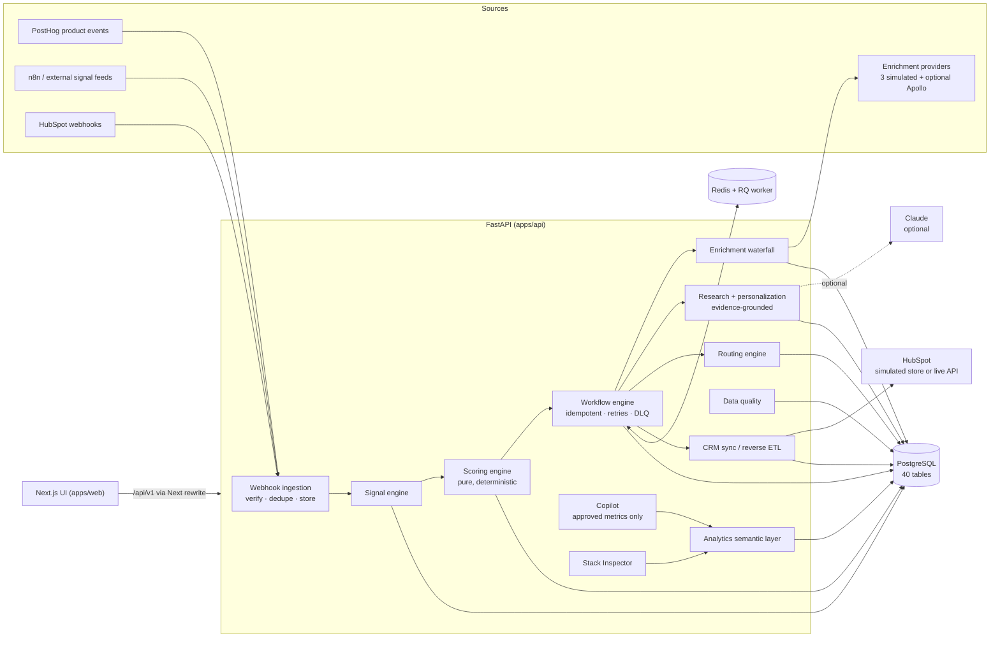

# GTMOS

**An AI-native revenue engine: it finds the accounts to sell to, explains why now, drafts evidence-grounded outreach for human approval, then routes, syncs and measures everything on deterministic, auditable infrastructure.**


> **Everything you see is DEMO data.** GTMOS ships with a deterministic, synthetic dataset for a fictional
> seller (*Sentinel AI*, reliability infrastructure for AI agents) and 2,000 fictional target accounts on
> reserved `.example` domains. Every integration runs in a clearly labeled **DEMO / SIMULATED** mode unless you
> configure credentials. GTMOS never sends email or LinkedIn messages.

---

## Why I built this

Modern GTM teams run on a patchwork: enrichment in Clay, scoring in a spreadsheet, routing in HubSpot
workflows, signals in five browser tabs, attribution in a BI tool nobody trusts, and "AI personalization" that
invents facts. The GTM Engineer's job is to turn that patchwork into **a system**: one where every account has
an explainable score, every signal becomes an action within minutes, every automation is idempotent and
observable, and AI accelerates reps without becoming an unreviewed source of CRM truth.

GTMOS is that system, built end to end: the data model, the deterministic engines, the integration boundaries
and the operating surfaces. It shows I can design, build and operate GTM infrastructure myself rather than only
configure SaaS tools.

## What it does

GTMOS runs the full loop:

```
TARGET → ENRICH → DETECT SIGNALS → SCORE → RESEARCH → IDENTIFY BUYERS → PERSONALIZE → APPROVE
       → ROUTE → SYNC CRM → TRACK ENGAGEMENT → CREATE OPPORTUNITY → MEASURE → EXPERIMENT → LEARN
```

| Question a GTM leader asks | Where GTMOS answers it |
|---|---|
| Which companies should we target? | **Accounts**: 2,000 accounts scored against a versioned ICP |
| Why are they a fit? | **Account page → Why this score**: every point traced to a rule and its evidence |
| Why contact them now? | **Signals**: funding, AI hiring, launches, exec hires and PLG events, with time decay |
| Who should we contact? | **Buying committee**: champion, economic buyer, evaluator, sponsor, user, each with reasons |
| What should we say? | **Research + Outreach**: cited research brief, guardrailed drafts, human approval queue |
| What happens next? | **Workflows + Routing**: trigger → conditions → actions, explainable routing with conflicts |
| What is happening in the funnel? | **Overview / Pipeline**: funnel, velocity, stuck accounts, attribution |
| Which experiments work? | **Experiments**: deterministic assignment, Wilson CIs, z-test, no premature winners |
| Where is pipeline leaking? | **Copilot + Stack Inspector**: approved analyses, ranked fixes with evidence |
| Is the GTM stack healthy? | **Stack Inspector / Operations / Data Quality** |

### Highlights

- **Explainable scoring, and an honest measurement of whether it works.** Fit 35 · Intent 25 · Timing 15 ·
  Technical 15 · Engagement 10, with half-life decay, grade X exclusions and a reproducible input hash. Then
  `make backtest` grades it: AUC with confidence intervals, conversion by grade, precision@K — and separates
  the score into a structural part (firmographics, no leakage) and the total (which includes engagement, and
  therefore partly predicts itself). On the demo data the structural AUC is 0.537 with an interval that
  **includes 0.5**, and [the report says so](docs/scoring-evaluation.md) rather than quoting the flattering
  0.593.
- **Signals that can say no.** Six of the nineteen signal types are disqualifying — competitor adopted,
  layoffs, budget freeze, champion departed, unsubscribed, initiative cancelled — and each carries the action
  it implies. Penalties apply *after* the category caps, because inside a category a full engagement score
  would absorb a champion's departure entirely.
- **Clay-style enrichment waterfall that surfaces disagreement.** Per-field provider order, fallbacks on miss,
  error or low confidence, cost accounting, field-level provenance, and manual locks that are never
  overwritten. When two confident providers contradict each other, the stored value is **kept** and the
  disagreement is raised as a data-quality issue — the rejected answer is shown on the account page, because a
  value three providers agree on and a value one won by 0.05 confidence should not look identical.
- **Evidence-grounded AI.** Research claims must cite numbered evidence (E1..En) and uncited claims are
  stripped. Drafts follow *signal → pain → value → proof → CTA* and pass guardrails (no ungrounded numbers, no
  superlatives, verified signal, reachable contact) before they can be approved.
- **A real workflow engine.** Idempotency keys per trigger event, persisted step state, retries with backoff,
  dead letters, manual retry that resumes at the failed step, and inline or Redis/RQ execution.
- **Safe CRM integration.** A HubSpot adapter boundary that upserts on a custom unique property
  (`gtmos_account_id`, because HubSpot doesn't enforce `domain` uniqueness), batches of ≤100, 429/5xx retry,
  payload-hash change detection, and reverse ETL of computed properties.
- **Signed webhooks.** HMAC with a replay window (n8n and generic senders), token header (PostHog), HubSpot v3
  verification, dedupe on event id, replayable failures. Rejected deliveries can't poison idempotency keys.
- **Experiments that can say "do not ship".** Guardrail metrics (bounce, unsubscribe, spam complaint, negative
  reply) are evaluated one-sided for harm, and a breach outranks any win on the primary metric. The seeded
  provocative-subject test lifts reply rate 21.8% → 40.5% and is still rejected, because unsubscribes go 0.35%
  → 2.25%. A minimum detectable effect is reported with every result, so a null reads as "no effect" or
  "underpowered" rather than ambiguously.
- **Routing with a clock.** Named accounts no rule can move, a fallback queue so nothing is simply unowned,
  round robin that stays idempotent across a replay, and a per-rule first-touch SLA. Speed to lead is measured
  against the first real outbound touch, counts only genuine lead events (a territory reshuffle starts no
  clock), and keeps "late" separate from "never touched".
- **Operating surfaces.** Data Quality (12 rules with audited remediation), Stack Inspector — which traces
  **causal chains**, one account set intersected through every link, and reports the true overlap rather than
  two true numbers about different accounts — Operations, and a full audit log.
- **A stop button.** Runtime kill switches for automation, outbound and CRM writes, read from the database on
  every action so a pause takes effect immediately rather than after a deploy. Blocked requests return `423`
  with the operator's reason; queued work stays queued.
- **Safe Copilot.** Question → intent → *approved* metric function → deterministic numbers → explanation. No
  LLM-generated SQL, ever, and metrics GTMOS does not model (revenue, churn, NPS, CAC) are named as gaps
  instead of approximated by the nearest metric that shares a word.
- **A warehouse layer.** A [dbt project](warehouse/) modelling the operational database into analytics marts,
  with 19 models and 113 tests, checked against the API's semantic layer so the two cannot drift apart.
- **Evaluation for generated content.** `make llm-eval` grades whichever writer is configured against
  adversarial cases: invented citations, ungrounded numbers, banned superlatives, and instructions hidden in
  the evidence. It found a real one — untrusted feed text was being copied verbatim into research reports.

## Demo workflow

The fastest tour (≈10 minutes; full script in [`docs/demo-script.md`](docs/demo-script.md)):

1. **Overview**: the command center; note the DEMO banner and the "Act now" accounts.
2. **Accounts → Kestrel Analytics** (the flagship). A $120M Series C 12 days ago, a new VP of AI, an AI agent
   launch, 14 open AI roles, a champion already using the free product. **Why this score** shows every point.
3. **Buying committee → Research**: the committee's rationale, then a research brief where every sentence
   links to evidence.
4. **Run signal → outreach workflow**: enrich → rescore → committee → research → draft → route → CRM sync.
   The draft **multi-threads to the economic buyer** and references the engaged champion, because the account
   already has an open opportunity.
5. **Approvals**: guardrails, reasoning chain and evidence. Approve, or watch a fabricated metric get blocked.
6. **Workflows → run detail**: step timeline, attempts, idempotency key and correlation id.
7. **Routing → simulator**: see a high-intent enterprise account beat the territory rule and why.
8. **Experiments**: open `provocative-subject`. The treatment wins reply rate by 18.7 percentage points with
   p < 0.001 — and the recommendation is **do not ship**, because unsubscribes went 0.35% → 2.25% and negative
   replies 3.1% → 11.3%. This is the page to spend time on: optimising reply rate alone is how teams burn a
   sending domain.
9. **Data Quality → Stack Inspector → Copilot → Operations**: the system inspecting itself.

| | |
|---|---|
|  |  |
|  |  |
|  |  |

More, with captions: [`docs/screenshots.md`](docs/screenshots.md).

## Architecture



- **Deterministic core, AI at the edges.** Scoring, routing, workflow conditions, experiment assignment and
  statistics, attribution, data quality and analytics are pure functions with unit tests. The LLM only writes
  prose from a supplied evidence pack, and its output is validated like any other generator's.
- **Postgres is the source of truth; Redis is delivery.** Workflow runs are rows first. They're enqueued
  *after commit*, and a sweeper re-enqueues anything stuck in `queued`.
- **Every mutation is audited** with actor, before/after, reason and correlation id.

Details: [`docs/architecture.md`](docs/architecture.md) · [`docs/data-model.md`](docs/data-model.md) ·
[`docs/integrations.md`](docs/integrations.md) · [`docs/warehouse.md`](docs/warehouse.md) ·
[`docs/n8n.md`](docs/n8n.md).

## GTM concepts demonstrated

| Concept | In GTMOS |
|---|---|
| **ICP** | Versioned, validated definition (industries, size bands, regions, technographics, personas, signal budgets, exclusions, weights); preview grade changes before saving |
| **Enrichment** | Waterfall per field across providers with fallbacks, confidence thresholds, cost, provenance and merge policy |
| **Signals** | 13 types across intent / timing / engagement, each with source, confidence, strength, evidence, dedupe key and half-life decay |
| **Scoring** | Explainable 100-point model; fit vs "why now" (intent index); A–D grades; exclusions |
| **Routing** | Priority → specificity → key conflict resolution, ownership respect, inactive-owner reassignment, least-loaded pools with capacity |
| **CRM** | Mini-CRM with funnel + deal stages, forward-only lifecycle, stage history, HubSpot object mapping |
| **Workflows** | Trigger → conditions → actions; idempotent, resumable, retryable, observable |
| **Outbound** | Campaigns → sequences → steps; sent/delivered/replied/positive/meeting/opportunity/won; opens explicitly untrusted |
| **Experimentation** | Account-level hash assignment, Wilson intervals, two-proportion z-test, Newcombe CI, minimum sample |
| **Attribution** | First, last, linear and U-shaped side by side; unattributed share reported |
| **Reverse ETL** | Computed properties (`gtmos_icp_score`, `gtmos_intent_score`, `gtmos_account_tier`, `gtmos_last_signal`, `gtmos_next_best_action`) pushed with change detection |
| **Data quality** | Duplicates, invalid emails, missing fields, stale enrichment, orphans, lifecycle conflicts, missing owners, invalid transitions, bad external IDs |
| **Observability** | Workflow/sync/webhook health, provider hit and error rates, routing latency, correlation IDs, audit log |

A deeper explanation of each, with file references: [`docs/gtm-concepts.md`](docs/gtm-concepts.md).

## Integrations — and exactly how far each one is verified

The stack GTMOS is built to sit inside: **PostHog** watches the product, **Clay** buys enrichment,
**n8n** moves data between systems, **HubSpot** is where reps work, and GTMOS owns the judgement in the
middle. The argument for that split is in [`docs/phase3-architecture.md`](docs/phase3-architecture.md);
the tools themselves are explained in [`docs/gtm-tool-guide.md`](docs/gtm-tool-guide.md).

Verification levels are used strictly, because a project claiming four live integrations it never ran
is worse than one claiming none:

| | Meaning |
|---|---|
| **Verified locally** | Actually executed on this machine, end to end, with evidence |
| **Verified in simulation** | Runs fully against a simulated counterpart; the live adapter is implemented but unrun |
| **Ready — needs credentials** | Built against the documented contract and tested against it; never talked to the real service |
| **Not implemented** | Deliberately absent |

| Integration | Status | What that means concretely |
|---|---|---|
| **n8n** | **Verified locally** | Runs in Docker, pinned to `n8nio/n8n:2.40.5`. Six workflows imported, published and **executed** against the running API. Deduplication proven: one batch delivered three times with different `attemptNumber` values yields one event with `duplicate_count` 0 → 1 → 2. The error workflow was proven by deliberately breaking another workflow. One workflow (`04`) calls `api.hubapi.com` and is reported as **not executed** for want of a token. See [`docs/n8n.md`](docs/n8n.md). |
| **HubSpot CRM** | **Verified in simulation** · live **ready — needs credentials** | The demo adapter fully works: companies, contacts, deals and associations, batch upsert on a custom unique property, bounded retry, payload-hash change detection, inbound webhooks with v3 **and v1** signature verification. The live adapter is implemented against current documented APIs and has **never run against a real portal**. Setup: [`docs/hubspot-live-setup.md`](docs/hubspot-live-setup.md). |
| **PostHog** | **Verified in simulation** · live **ready — needs credentials** | The inbound path is exercised continuously: PostHog-shaped events with `$groups.company` resolve to an account, become engagement rows, and feed a composite product-qualified rule. **No PostHog account exists**, so nothing has been received from real PostHog. Note that group analytics is a paid add-on. Setup: [`docs/posthog-live-setup.md`](docs/posthog-live-setup.md). |
| **Clay** | **Ready — needs credentials** | Boundary built against Clay's documented Public API and signed-webhook contract, tested locally with `httpx.MockTransport` and recorded payloads. **Never run against a live Clay workspace**; no account exists and nothing was purchased. The API itself reports `verified_against_live_clay: false`. Setup: [`docs/clay-live-setup.md`](docs/clay-live-setup.md). |
| Enrichment providers | **Verified in simulation** · Apollo **ready — needs credentials** | Three simulated providers with coverage gaps, noise, cost and failures, which deliberately disagree with each other. Apollo adapter unrun. |
| Claude (LLM) | **Ready — needs credentials**, off by default | Deterministic generators without configuration. Live research needs `ANTHROPIC_API_KEY` **and** `LLM_ENABLED=true`; neither was used at any point in building this. |
| Email / LinkedIn sending | **Not implemented, by design** | "Ready" is the hand-off to a sequencer. Deliverability is modelled as a *constraint*, not an activity. |

### The golden flow

One command runs a single account through every boundary above:

```bash
make golden-flow              # 20 steps, direct to the API
VIA_N8N=1 make golden-flow    # the same, routed through the real n8n container
```

Three people at one company use the product → PostHog-shaped events → n8n normalises and signs them →
GTMOS resolves the account, fires the product-qualified rule, moves the score, triggers a workflow and
routes an owner → reverse ETL pushes the company and associates its contacts → the CRM sends a change
webhook back → **the same webhook is delivered again and deduplicated** → analytics, Operations and the
audit log all reflect it. It is deterministic and replayable; both transports pass all twenty steps.

## Running locally

**Prerequisites:** Docker, Python 3.13 + [uv](https://docs.astral.sh/uv/), Node 20+ (24 tested).

```bash
git clone <this repo> gtmos && cd gtmos
make setup          # uv sync + npm ci
make dev            # Postgres+Redis in Docker, migrate, seed (~1 min), API :8010 + web :3010
```

Open **http://localhost:3010**. API docs: **http://localhost:8010/docs**.

Or run everything in containers (API, worker, web, Postgres, Redis):

```bash
make up             # web http://localhost:3010 · API http://localhost:8010
```

Host ports are deliberately uncommon (Postgres **56432**, Redis **56379**) to avoid clashing with other local
services; override with `GTMOS_DB_PORT`, `GTMOS_REDIS_PORT`, `GTMOS_API_PORT`, `GTMOS_WEB_PORT`.

Useful commands: `make reset` (reload the demo dataset), `make n8n` (optional local n8n on :5678),
`make help` (all targets). Configuration: copy `.env.example` to `.env`; nothing in it is required.

## Testing

```bash
make test           # backend unit + integration (Postgres), frontend component tests
make lint typecheck # ruff + ruff format, ESLint, mypy --strict, tsc
make e2e            # Playwright smoke suite against a running stack (desktop + mobile)
make check          # everything above + production web build
```

| Suite | Count | What it covers |
|---|---|---|
| Backend unit (pytest) | 132 | Scoring including disqualifying signals, the enrichment waterfall and its conflict policy, routing conflicts/round robin/SLAs, committee, experiment and attribution maths, evaluation statistics against hand-computed cases, the content-evaluation graders against a deliberately broken writer, rules, pipeline transitions, matching, research citations, guardrails, live HubSpot/Apollo adapter contracts (mocked HTTP), webhook signatures |
| Backend integration (pytest + Postgres) | 185 | API contracts, signal → workflow → draft → CRM, idempotency, worker concurrency and crash recovery, retries → dead letter → resume, signed webhooks and HubSpot batch dedupe, PQL flow, reverse-ETL idempotency, data quality merges, the scoring backtest's honesty properties, causal chains, experiment guardrails, kill switches, Copilot adversarial attacks, admin-token gating |
| Frontend (Vitest + Testing Library) | 14 | Formatters, safe markdown (HTML injection), URL helpers, accessible meters, confirm-before-mutate, inline API errors |
| E2E (Playwright, production build) | 22 | Demo flow, every page renders without error boundaries, mobile has no horizontal scroll, mobile navigation |

Bugs found by these tests and fixed with regression tests include: a waterfall cache miss across positions; an
unsigned delivery blocking a later valid signed delivery (idempotency-key poisoning); **HubSpot retries never
deduplicating at all**, because its payload is a JSON array with an incrementing `attemptNumber` so every
retry hashed differently; an invalid signature returning `200` for a known event id; **two workers executing
the same workflow run** and duplicating every side effect; a crashed run never being re-enqueued; Data Quality
sorting a page rather than the table, so an older high-severity issue could never reach the top; the Copilot
answering "what's the churn rate" with a meeting-rate number; and untrusted signal text being copied verbatim
into research reports.

## Screenshots

[`docs/screenshots.md`](docs/screenshots.md) is the annotated tour, with a note on each image saying what to
look at. All of it is the DEMO dataset.

## Design decisions

- **Deterministic first.** Anything that routes revenue or changes CRM state is a pure, tested function. LLMs
  write prose from evidence and never decide.
- **Human in the loop for every outbound word.** Drafts go DRAFT → REVIEW → APPROVED → READY; blocking guardrails
  prevent approval.
- **Idempotency everywhere.** Unique keys on signals, workflow runs, webhook events and external records;
  upserts on stable keys; payload hashing to skip unchanged syncs.
- **Honest data.** Seed data is synthetic and labeled. The simulated providers answer from the same
  deterministic universe, so enrichment fills real gaps instead of inventing values.
- **Understandable stack.** FastAPI + SQLAlchemy + Postgres + Redis/RQ + Next.js: boring on purpose, easy to
  explain, easy to run.

## Production considerations

- **Auth:** V1 runs as a single demo operator. Production needs SSO/OIDC, RBAC (rep vs RevOps vs admin),
  per-workspace isolation (the schema is already multi-tenant) and row-level authorization.
- **Scale:** move scoring to incremental recomputation on events, partition activities/engagements by time, add
  a proper job scheduler for nightly enrichment/DQ/reverse ETL, and put rate-limit budgets on providers.
- **Warehouse:** the dbt project in [`warehouse/`](warehouse) already models the operational database into
  analytics marts and its numbers are checked against the API's semantic layer. At scale it would sit behind
  a replication layer (Fivetran/Airbyte into Snowflake or BigQuery) rather than reading `public` directly, and
  reverse ETL would sync from there; the contract (keys, hashing, conflict policy) stays the same.
  See [`docs/warehouse.md`](docs/warehouse.md).
- **LLM operations:** prompt/version registry, offline evals on a golden set (citation validity, unsupported
  claim rate), cost budgets and caching.

## The part I would ask about in an interview

A demo is easy to make impressive and hard to make trustworthy. The things I would want a GTM engineer to
push on are the places where GTMOS reports something inconvenient:

| Claim it would be easy to make | What GTMOS actually reports |
|---|---|
| "The score predicts conversion" | Structural AUC **0.537**, interval 0.485–0.589 — not distinguishable from random on this data. The leaking variant scores 0.593 and the report explains exactly why that number is contaminated. |
| "Attribution shows what worked" | Four models, a deliberately **unattributed tail**, and a worked example where first-touch credits one campaign 100% and last-touch credits a different one 100% on the same deal. |
| "Our best message won" | The winning subject line is recommended **against**, because it doubled unsubscribes while lifting replies. |
| "Routing is solved" | 84% of lead-event assignments met their SLA; 98 were late and 9 were never touched at all. |
| "The AI is grounded" | The evaluation harness found the generator copying attacker-supplied text out of a signal feed into a research report, and that is written up in [`docs/llm-evaluation.md`](docs/llm-evaluation.md). |
| "The data is clean" | 499 open data-quality issues, including 18 fields where two providers materially disagree and GTMOS refused to pick a winner. |
| "Lead-to-account matching works" | Precision **0.962** on a held-out set — with a 0.894–0.987 interval and an explicit statement that 116 cases cannot distinguish that from 0.90. The threshold was tuned on a disjoint development set, and two held-out failures were left unfixed rather than burn the holdout. |
| "The integrations are live" | One of four is verified by execution (n8n). The other three are honest about needing credentials, and the API reports `verified_against_live_clay: false` itself rather than leaving it to the README. |

Every one of those numbers is computed from the demo dataset by code in this repository, and every one of them
is reproducible with `make reset && make backtest`.

## Limitations

- All data is synthetic. No real customers, results or revenue are represented.
- The real HubSpot, Clay and Apollo adapters are implemented against current documented APIs but have
  **never run against the live services**; the live Claude path is implemented but disabled, and was not
  used at any point in building this. No account was created and nothing was purchased for any of them.
- PostHog's inbound path is exercised continuously, but no event has ever arrived from a real PostHog
  project. Note also that PostHog's group analytics — which is what makes account-level product signals
  possible — is a paid add-on.
- No email sending, no sequencer integration, no calendar integration.
- Single-tenant UI and demo-safe auth (see Production considerations).
- The workflow editor is definition-as-data with a read-only visual view, not a drag-and-drop builder.
- Some operational history (older workflow runs, sync runs, webhook events) is seeded synthetic history and
  is labeled as such in the UI. Recent runs were actually executed by the engine.

## Repository layout

```
apps/api        FastAPI service: models, domain (pure logic), services, integrations, seed, tests
apps/web        Next.js app: pages, UI primitives, charts, Vitest + Playwright tests
integrations/n8n  Importable n8n workflow templates
warehouse/      dbt project: staging views + analytics marts over the operational database
docs/           Research, spec, architecture, data model, concepts, integrations, demo script, interview prep
```

## Documentation

**Start here if you are new to GTM tooling:** [The GTM tool guide](docs/gtm-tool-guide.md) explains
HubSpot, Clay, n8n and PostHog through this repository.

**Architecture and integrations**
[Phase 3 architecture](docs/phase3-architecture.md) · [Architecture](docs/architecture.md) ·
[Data model](docs/data-model.md) · [Integrations](docs/integrations.md) ·
[CRM sync design](docs/crm-sync-design.md) · [Warehouse layer](docs/warehouse.md) ·
[n8n](docs/n8n.md)

**Connecting real services** (none of these have been run live)
[HubSpot](docs/hubspot-live-setup.md) · [PostHog](docs/posthog-live-setup.md) ·
[Clay](docs/clay-live-setup.md)

**Evaluation and honesty**
[Scoring evaluation](docs/scoring-evaluation.md) · [Scoring backtest](docs/scoring-backtest.md) ·
[Matcher evaluation](docs/matcher-evaluation.md) · [Content evaluation](docs/llm-evaluation.md) ·
[Failure tournament](docs/failure-tournament.md) · [Security review](docs/security-review.md)

**Reference and interview prep**
[Market research](docs/market-research.md) · [Product spec](docs/product-spec.md) ·
[GTM concepts](docs/gtm-concepts.md) · [Demo script](docs/demo-script.md) ·
[Interview guide](docs/interview-guide.md) · [Interview questions](docs/interview-questions.md) ·
[Resume bullets](docs/resume.md) · [Screenshots](docs/screenshots.md)

**Phase reports**
[Phase 2 audit](docs/phase2-audit.md) · [Phase 2 final](docs/phase2-final-report.md) ·
[Phase 3 baseline](docs/phase3-baseline.md) · [Phase 3 final](docs/phase3-final-report.md)

**Tool research** (written from official documentation)
[HubSpot](docs/research/hubspot.md) · [n8n](docs/research/n8n.md) ·
[PostHog](docs/research/posthog.md) · [Clay](docs/research/clay.md)

## License

MIT. See [LICENSE](LICENSE).
