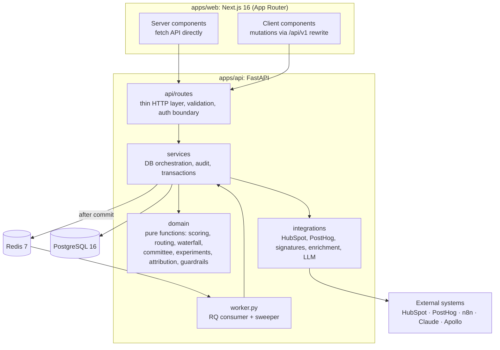

# Architecture

GTMOS is a modular monolith: one FastAPI service with a clean internal split between **pure domain logic**,
**services** that orchestrate the database, and **integration adapters** at the edges. A Next.js app renders
the operating surfaces, and a Redis/RQ worker executes workflow runs asynchronously in the containerized stack.



## Layers

| Layer | Responsibility | Rules |
|---|---|---|
| `domain/` | Business logic as pure functions over dataclasses/Pydantic models | No database, no network, no clock (callers pass `now`). 100% unit-testable. |
| `services/` | Load facts, call domain, persist results, write audit events | Own the transaction boundary *within* a request; never commit (routes do) |
| `integrations/` | Adapters behind protocols (`CrmAdapter`, `EnrichmentProvider`, `ResearchWriter`) | Demo and live implementations share one interface; live ones need explicit configuration |
| `api/routes/` | HTTP, validation, pagination, the demo-safe auth boundary | Commit once per request; map domain errors to 404/409/422 |
| `seed/` | Deterministic synthetic universe and dataset | Reproducible: fixed RNG seeds, uuid5 ids, `.example` domains |

## Key flows

### Signal → workflow → draft → CRM

```mermaid
sequenceDiagram
  participant Src as Signal source (API, n8n, PostHog)
  participant Sig as signal_service
  participant Sc as scoring_service
  participant WF as workflow_engine
  participant Q as Redis/RQ (or inline)
  participant Act as Actions
  participant DB as Postgres

  Src->>Sig: ingest (type, account, source_ref, confidence)
  Sig->>DB: insert signal (unique dedupe_key) or return existing
  alt duplicate
    Sig-->>Src: created=false, no side effects
  else new
    Sig->>Sc: rescore account
    Sc->>DB: icp_scores + score_components (history kept)
    Sig->>WF: emit signal.created (+ score.threshold_crossed)
    WF->>DB: create run (unique idempotency key), evaluate conditions
    WF->>Q: enqueue after commit
    Q->>WF: execute_run(run_id)
    loop each step (persisted)
      WF->>Act: enrich · rescore · committee · research · draft · route · sync
      Act->>DB: results + audit events
      Note over WF,Act: TransientError → retry with backoff;<br/>exhausted → dead_letter
    end
  end
```

### Scoring

`score_account(icp, facts, signals, engagement, now) → ScoreResult` is pure. The service layer loads facts in
bulk (500 accounts per chunk), writes an `icp_scores` row plus one `score_components` row per rule, and caches
`icp_score`, `score_grade` and `intent_score` on the account for fast list views. The `inputs_hash` (SHA-256 of
ICP, facts, signals, engagement and date) makes any score reproducible.

### Enrichment waterfall

`run_waterfall(domain, fields, waterfall, providers, existing, now)` walks each field's provider order,
batching fields that share a provider at the same position into one call. The first call asks for everything
that provider can supply, so later positions reuse the cached response and each provider is charged once.
Outcomes are `hit`, `miss`, `low_confidence` (kept as a fallback), `error` or `skipped`. `decide()` applies the
merge policy: fill empty fields, never overwrite manual locks, replace only with clearly higher confidence or
when the existing value is stale.

### Research and personalization

1. `build_evidence_pack` numbers everything GTMOS actually holds: firmographics with provenance, signals,
   committee, activities, score (E1..En).
2. A generator writes claims that cite evidence refs. The deterministic generator only restates and combines
   evidence; the optional Claude writer gets the same pack and a structured-output schema.
3. `validate_sections` drops claims with no valid citation and records them as unsupported.
4. Personalization builds *signal → pain → value → proof → CTA*, where proof comes only from a seller-approved
   proof library. `run_guardrails` checks grounded numbers, banned claim patterns, signal freshness and
   confidence, length, CTA, personalization and contact reachability. Blocking failures prevent approval.

### Webhook ingestion

`verify → parse → idempotency key → dedupe → store raw → process in a savepoint → record outcome`. Processing
failures become `failed` (replayable), and repeated failure becomes `dead_letter`. **Rejected deliveries
(bad signature) never count as "seen"**, so an attacker can't pre-empt a legitimate event by sending an
unsigned copy first. This was found by an integration test and fixed.

### CRM sync / reverse ETL

Build desired properties → hash → skip unchanged (`external_records.last_payload_hash`) → upsert changed
records in batches of ≤100 on a unique key → retry transient failures (up to 3 rounds) → record an
`integration_syncs` row with counts, errors and duration → update integration health. Demo mode writes to
`simulated_crm_objects` and marks everything `is_simulated`.

## Reliability properties

| Property | Mechanism |
|---|---|
| No duplicate signals | `UNIQUE(workspace_id, dedupe_key)` from (type, account, source_ref) |
| No duplicate workflow runs | `UNIQUE(idempotency_key)` = workflow key + version + trigger + event id; concurrent inserts caught via savepoint |
| No duplicate CRM records | Upsert on `gtmos_account_id` (unique custom property) / `email`; external id map |
| Idempotent side effects | Tasks and notifications keyed by run id; drafts created once per run |
| Resumable runs | Step state persisted; retry skips succeeded steps |
| Transient failure handling | `TransientError` → retry with backoff (2s, 8s, 32s… capped) → dead letter |
| Queue loss tolerance | Runs are rows first; after-commit enqueue; sweeper re-enqueues stale `queued` runs |
| Traceability | Correlation id per request, propagated to runs, syncs, webhooks and audit events |

## Security boundary

- **Secrets** only from environment variables (`config.py`); `.env` is git-ignored and `.env.example` has no
  values.
- **Live side effects are opt-in:** HubSpot writes need a token *and* `HUBSPOT_LIVE_WRITES_ENABLED`; LLM calls
  need a key *and* `LLM_ENABLED`. There is no email sending path.
- **Admin token** (`ADMIN_API_TOKEN`) gates ICP changes and live CRM writes; it's required in production.
- **Webhooks:** HMAC with a 5-minute replay window, token header for PostHog, HubSpot v3 signatures. Missing
  secrets are tolerated only outside production.
- **No arbitrary code or SQL execution:** conditions are data (`domain/rules.py`, no `eval`); the Copilot can
  only call whitelisted analytics functions.
- **Input validation** via Pydantic on every body; CORS is an explicit allow-list; security headers are set on
  API and web responses; the UI never renders HTML from API strings.

## Frontend

- Server components fetch the API directly (`API_INTERNAL_URL`); `await connection()` in the fetch helper keeps
  data pages request-time rendered.
- Client components mutate through the same-origin rewrite `/api/v1/*` and then `router.refresh()`, so there
  are no CORS issues and the host isn't hardcoded.
- Design tokens (light and dark) live in `globals.css`. The chart palette was validated for color-vision
  deficiency and contrast; charts use one axis, no animation, and hover tooltips.

## Why this architecture

- **Modular monolith over microservices:** one deployable, one transaction boundary, and trivially
  explainable. The seams (`domain`, `services`, `integrations`) are where services would split at scale.
- **Postgres + JSONB:** relational integrity for CRM objects, JSONB for rule definitions, evidence and payloads.
- **RQ over Celery/Temporal:** the simplest durable queue that demonstrates the pattern. At higher scale, run
  state is already persisted, so moving to Temporal or a cloud queue is a transport swap.
- **Next.js server components:** dense operational pages render server-side with no client data layer to
  maintain.

## Scaling notes (10×)

- Event-driven incremental rescoring instead of batch rescoring; partition `activities`, `engagements` and
  `signals` by month.
- Move analytics to a warehouse (dbt) and serve the semantic layer from it; GTMOS keeps operational state.
- Provider rate-limit budgets and caching in Redis; circuit breakers per provider.
- Dedicated scheduler for nightly enrichment, DQ scans and reverse ETL; per-tenant queues.
- Read replicas for dashboards; move audit events to append-only storage.
