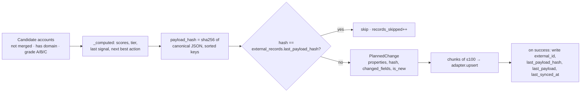
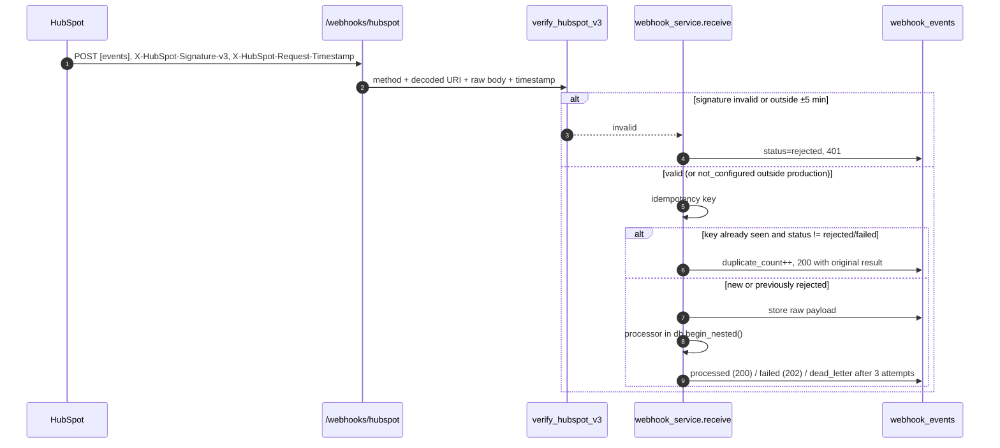

# CRM Sync Design

How GTMOS keeps a CRM in step with its own account intelligence: what it owns, how it detects change, how it fails, and what it deliberately does not do.

This describes the code in `integrations/hubspot.py`, `services/crm_sync.py`, `services/webhook_service.py`, `integrations/signatures.py`, `models/ops.py` and `api/routes/integrations.py` (under `apps/api/src/gtmos/`). Absent behaviour is marked **Not implemented** with the work it would take. The live HubSpot adapter has never been run against a real portal; it is covered only by unit tests with a mocked HTTP transport, against the API shape in [research-notes-integrations.md](research-notes-integrations.md).

---

## 1. Ownership model

The sync is a one-directional reverse ETL with a narrow, explicit write scope. GTMOS computes account intelligence; the CRM is where reps work. Neither side is allowed to silently clobber the other.

| Field class | Owner | Written by GTMOS? | What happens to the other side's edits |
|---|---|---|---|
| `gtmos_icp_score`, `gtmos_intent_score`, `gtmos_score_grade`, `gtmos_account_tier`, `gtmos_last_signal`, `gtmos_last_signal_at`, `gtmos_next_best_action` | GTMOS | On every push where the computed payload changed | A rep edit to one of these is overwritten the next time the computed payload changes. These are outputs, not inputs. |
| `gtmos_account_id` | GTMOS | On create and on every upsert (the adapter re-injects it as the id property) | Changing it in the CRM detaches the record; the next sync creates a new company. |
| `name`, `domain` | HubSpot / reps after creation | Only on **create** | Rep renames and domain corrections survive every later push. |
| Owner, lifecycle stage, deal stage, notes, activity | HubSpot / reps | Never (in the default payload) | Untouched. |
| `numberofemployees`, `city`, `country`, `lifecyclestage`, `gtmos_industry` | GTMOS warehouse view, backfill only | Only when `full_record=True` | See the note below: that path re-sends `name`/`domain` too. |

The rule lives in `plan_company_sync` (`services/crm_sync.py`):

```python
owned = {k: v for k, v in computed.items() if v is not None}
if full_record:
    props = company_properties(a, computed)
elif prev is None:
    props = {k: v for k, v in {"domain": a.domain, "name": a.name, **owned}.items() if v is not None}
else:
    props = owned
```

`prev` is the `external_records` row for `(provider="hubspot", object_type="companies", internal_id=account.id)`. Its absence is the definition of "this account has never been pushed". So: **first push carries `domain`, `name` and the `gtmos_*` fields; every later push carries only `gtmos_*` fields.** `computed` comes from `_computed()`, which always includes `gtmos_account_id` (a non-null UUID string), so the payload is never empty and the hash is never degenerate.

`SEGMENT_TIER` turns the segment into a readable label (`strategic → "Tier 1: Strategic"` … `smb → "Tier 4: SMB"`, anything else `"Unknown"`). `gtmos_next_best_action` is the label from the deterministic rule engine in `services/next_action.py`, computed in bulk via `next_best_actions()` so the plan costs a fixed number of queries regardless of account count.

**Caveat on `full_record=True`.** `company_properties()` includes `name` and `domain` unconditionally, so a backfill push *would* overwrite a rep's rename. Nothing passes `full_record=True` today — `preview_reverse_etl`, `run_company_sync`'s default and the `sync_crm` workflow action all use `False` — so the path is unreachable outside a test. A production version should drop `name`/`domain` from the backfill payload or gate it behind an explicit "overwrite CRM names" flag.

GTMOS never writes CRM values back into its own records automatically; see §5.

---

## 2. Object and property mapping

| GTMOS object | HubSpot object | Upsert key (`idProperty`) | Pushed today? |
|---|---|---|---|
| Account | `companies` | `gtmos_account_id` (custom, `hasUniqueValue: true`) | **Yes** |
| Contact | `contacts` | `email` | No — mapper exists, no job |
| Opportunity | `deals` | `gtmos_opportunity_id` (custom, `hasUniqueValue: true`) | No — mapper exists, no job |

This table is `ID_PROPERTY` in `integrations/hubspot.py` and is served verbatim by `GET /api/v1/integrations/hubspot/mapping` alongside `CUSTOM_PROPERTIES`.

### Why not key companies on `domain`

HubSpot documents `domain` as a company's primary identifier for deduplication, but it is not a unique-enforced property, and `batch/upsert` requires the `idProperty` to have unique values enforced — HubSpot's docs are explicit that companies created through the API are not deduplicated on domain. (**Unverified:** the exact rejection text is not reproduced here, because no live portal has ever been called from this project.) Beyond the API refusal, `domain` is a poor key: companies change domains, hold several (`hs_additional_domains`), and GTMOS's own matching normalises subdomains to parents, so two accounts can legitimately resolve near the same string. GTMOS creates its own `hasUniqueValue: true` property, stores the account UUID in it, and keys every write on that — a key that is stable for the account's lifetime and generated by GTMOS, which is what makes replay safe (§3).

Cost of that choice: **existing HubSpot companies are not matched by domain on the first live run.** Unless `gtmos_account_id` is backfilled onto them first (export, match on domain, re-import), the first sync creates parallel records (§8, step 4).

### Custom properties created by `ensure_properties()`

`RealHubSpotAdapter.ensure_properties()` POSTs each definition in `CUSTOM_PROPERTIES` to `/crm/v3/properties/{objectType}` with `groupName` from `PROPERTY_GROUPS` (`companies → companyinformation`, `contacts → contactinformation`, `deals → dealinformation`), treats `409` as "already exists", and logs anything else as a warning rather than failing the sync. It needs `crm.schemas.*` write scopes.

| Object | Properties |
|---|---|
| companies | `gtmos_account_id` (string/text, unique), `gtmos_icp_score` (number), `gtmos_intent_score` (number), `gtmos_score_grade` (string), `gtmos_account_tier` (string), `gtmos_last_signal` (string), `gtmos_last_signal_at` (datetime/date), `gtmos_next_best_action` (string/textarea), `gtmos_industry` (string) |
| contacts | `gtmos_contact_id`, `gtmos_buying_role` |
| deals | `gtmos_opportunity_id` (unique) |

`ensure_properties_once()` guards this with a **class attribute**, `RealHubSpotAdapter._properties_ensured`, so it runs at most once per process; `run_company_sync` calls it via `getattr(adapter, "ensure_properties_once", None)` and only when the plan has changes, so the demo adapter skips it. Being class-level rather than per-token, a second adapter with a different portal token in the same process skips property creation — fine for a single-portal deployment, a keyed cache if that changes.

### Deal stages

`DEAL_STAGE_MAP` maps GTMOS opportunity stages onto HubSpot's default pipeline: `discovery → appointmentscheduled`, `evaluation → qualifiedtobuy`, `proposal → presentationscheduled`, `negotiation → contractsent`, `closed_won → closedwon`, `closed_lost → closedlost`. `deal_properties()` falls back to the raw stage string for anything unmapped and hardcodes `pipeline: "default"`. Ownership runs the other way here: **deal stage belongs to the rep in the CRM**, so this mapper exists to create deals GTMOS originated, not to police stage.

### Associations, and why the primary type ids matter

`run_contact_and_deal_sync` (`services/crm_sync.py:567`) makes a second pass after the upserts: it reads
back both external ids and issues `POST /crm/v4/associations/{from}/{to}/batch/create` through
`adapter.associate` (`integrations/hubspot.py:358`). It writes the **primary** association types — `1` for
contact→company and `5` for deal→company — rather than the general variants `279` / `341`. The distinction
is not cosmetic: the primary association is what populates a contact's "primary company", which is what
territory assignment and most out-of-the-box reporting key off. Writing only the general type produces
records that look associated in the UI and behave as orphans in a report.

### Not implemented

- **Reconciliation against the remote record.** Change detection compares the payload hash against *what GTMOS last sent*, never against what HubSpot currently holds. `external_records.remote_updated_at` exists in the schema and is never read or written. An edit made to a `gtmos_*` field inside the CRM is therefore invisible until the computed value changes.
- **Conditional writes.** No optimistic-concurrency check against the remote `updatedAt`, so a rep editing during a sync can be overwritten within the fields GTMOS owns.
- **Notes, tasks, engagements.** Not mapped at all.
- **Archive/delete propagation.** See §7.

---

## 3. Change detection and idempotency



`payload_hash` is `sha256(json.dumps(props, sort_keys=True, default=str))`. Sorting makes the hash independent of dict order; `default=str` handles dates and UUIDs without a bespoke encoder.

One subtlety: when `full_record=False` the stored hash is `payload_hash(owned)` — the GTMOS-owned fields only — even on the create path, where the payload also contains `name` and `domain`. That is deliberate. If the hash covered the create payload, every account would look "changed" on the very next run (because updates no longer carry `name`/`domain`) and be re-pushed once for nothing.

`changed_fields` is computed against `external_records.last_payload`, the JSON actually last sent, which is what makes `preview_reverse_etl`'s `changed_field_counts` meaningful ("42 accounts would change `gtmos_next_best_action`") rather than a count of dirty rows.

**Batching.** `chunks(items, size=BATCH_LIMIT)` with `BATCH_LIMIT = 100`, the documented HubSpot ceiling. The adapter chunks, not the caller; `BatchOutcome.http_calls` counts the requests actually issued.

**Upsert semantics.** `RealHubSpotAdapter.upsert` sends `{"inputs": [{"idProperty": ..., "id": r.id_value, "properties": {**r.properties, id_prop: r.id_value}}]}` — the id value is re-injected into `properties` so a record created by the call carries the key and is found by the next one. Results are matched back by lower-cased id property value; an input missing from `results` is failed with the batch's `errors[].message` concatenated (max 500 chars). The `new` boolean used to tell created from updated is flagged **[unverified]** in the research notes and needs confirming against a real portal before those counts are trusted.

**Why replay is safe.** The key is generated by GTMOS and never changes; the write is an upsert on it, so a repeat converges instead of duplicating; and the hash skips an unchanged record before any HTTP call. Re-running `/reverse-etl/run` straight after a successful run does zero writes — the demo workspace's preview currently reports `considered: 635, would_create: 0, would_update: 0, unchanged: 635`.

**Not implemented:** cross-process locking. Two concurrent `run_company_sync` calls for one workspace both plan and both push; the writes are idempotent so the CRM converges, but the runs interleave `external_records` updates and the counts on one sync row are wrong. An advisory lock on `(workspace_id, job)` would fix it.

---

## 4. Retry, rate limits and backoff

There are two independent retry layers.

**Layer 1 — HTTP, inside the adapter (`_post`).** Up to `max_retries = 4` attempts per request. `429` and any `5xx` are retried; everything else returns immediately. The wait is `float(Retry-After)` when the header is present *and* `.isdigit()`, otherwise an exponential delay starting at 1s and doubling to a 30s cap. On the final attempt the response is returned as-is rather than raised, so the caller classifies it.

> **Limitation.** `isdigit()` accepts only a non-negative integer string, so `"1.5"` or `"Wed, 21 Oct 2026 07:28:00 GMT"` both fall through to exponential backoff. Correct handling would try `int()`, then `float()`, then `email.utils.parsedate_to_datetime()`, clamped to a sane maximum.

Published limits (research notes): 100 requests / 10s for a Free/Starter private app, 190 / 10s on Professional and Enterprise, daily ceilings of 250k–1M. A 429 body carries `policyName: DAILY | SECONDLY`; GTMOS does not read it, so daily-quota exhaustion burns its four attempts on the same short backoff as a burst limit. Reading `policyName` and the `X-HubSpot-RateLimit-*` headers, and pausing the run on `DAILY`, is the obvious next step.

**Layer 2 — record rounds, inside the sync job.** `run_company_sync` loops `while pending and rounds < MAX_RETRY_ROUNDS` (3). After the first round it does `sync.retries += len(pending)` and, when a `sleep` callable was injected, sleeps `min(2 ** (rounds - 1), 8)` seconds. Each round re-sends only the still-pending records, so a batch of 100 with 3 transient failures retries 3, not 100.

| Adapter outcome | Classification | Sync job behaviour |
|---|---|---|
| `created` / `updated` | success | `external_records` updated; on the live adapter `accounts.hubspot_company_id` is set; removed from `pending` |
| non-2xx with `429` or `5xx` (after the HTTP retries are exhausted) | `retryable=True` | kept in `pending` for the next round; after round 3 recorded with `note: "gave up after 3 attempts"` |
| non-2xx `4xx` (401, 403, 400 validation) | `retryable=False` | recorded immediately, removed from `pending` — no point retrying a bad token or an invalid property |
| present in a 200/207 body but missing from `results` | `retryable=False` | recorded with the batch's error messages |
| simulated `429` from `DemoHubSpotAdapter` | `retryable=True` | same as a real 429 |

`DemoHubSpotAdapter` fails deterministically: `_should_fail` hashes `"fail:{object_type}:{id}"` into `[0,1)` and fails when it is under `TRANSIENT_FAILURE_RATE = 0.03`, but only on a record's **first** attempt in that adapter instance. Every demo sync therefore exercises the retry path and every demo sync eventually succeeds — honest about the mechanism, dishonest about the world, so demo mode is never offered as evidence that live retries work.

**How failures surface.**

- One `integration_syncs` row per run: `records_considered / changed / succeeded / failed / skipped`, `retries`, `duration_ms`, `correlation_id`, `trigger`, `is_simulated`, the first 50 errors as JSON, and a `status` of `succeeded` (no errors), `partial` (some succeeded) or `failed` (none succeeded).
- `integrations.status` becomes `healthy` only on a clean `succeeded`; anything else sets `degraded` with `last_error_at` and `last_error` from the first error. The Operations page reads these rows.
- An `integration.synced` audit event with `actor_type="integration"`, `actor="hubspot_adapter"`, `reason="trigger=..."`.
- Inside a workflow, `sync_crm` re-raises a retryable failure as `TransientError`, so the step retries under its own `max_attempts` and can end in `dead_letter`; a permanent failure raises `RuntimeError` and fails the step outright.

---

## 5. Inbound events

`POST /api/v1/webhooks/hubspot` shares the pipeline in `services/webhook_service.py` with the PostHog and n8n endpoints: **verify → derive idempotency key → dedupe → store raw → process in a savepoint → record outcome**.



**Signature verification** (`integrations/signatures.py`). `hubspot_v3_signature` builds `METHOD.upper() + unquote(uri) + raw_body + timestamp_ms` and returns `base64(HMAC-SHA256(client_secret, source))`, compared with `hmac.compare_digest`. `verify_hubspot_v3` rejects a missing header pair, a non-integer timestamp, `now - ts > 300s` ("timestamp older than 5 minutes") and `ts - now > 300s` ("timestamp is in the future"). The future check is stricter than HubSpot documents and deliberate: a forged forward timestamp would otherwise buy an unbounded replay window. The signed URI is `str(request.url)` as the API sees it, so behind a TLS-terminating proxy uvicorn must run with proxy headers or every signature fails on scheme and host.

> **Known deviation.** HubSpot decodes only a fixed set of percent-encodings (`%3A %2F %3F %40 %21 %24 %27 %28 %29 %2A %2C %3B`) and leaves query-string delimiters encoded. GTMOS calls `urllib.parse.unquote(uri)`, which decodes everything, including `%26` and `%3D`. For the plain webhook URL the two agree; a subscription URL with percent-encoded query parameters would fail verification.

**Deduplication.** `idempotency_key_for` prefers an `Idempotency-Key` / `X-Idempotency-Key` header, then a payload `uuid` / `event_id` / `eventId` / `id`, then — for HubSpot's JSON **array** — the sorted set of member event ids (`"hubspot:batch:{ids}"`, collapsing to a hash of those ids when a large batch would overflow the column). Only a payload with no usable id anywhere falls back to a hash, and that hash is taken over a canonical form with the retry counters (`attemptNumber` and friends) stripped, so a redelivery hashes identically. Keys are truncated to 200 chars and `UNIQUE (source, idempotency_key)` enforces them under concurrency.

**Why inbound changes are logged and not applied.** The processor registered in `api/routes/integrations.py` is deliberately inert:

```python
return {"received": len(events), "applied": 0,
        "note": "Inbound CRM changes are logged; GTMOS-owned gtmos_* properties are never overwritten."}
```

Three reasons. **Loop prevention**: GTMOS writes `gtmos_*` properties, HubSpot emits `company.propertyChange` for those writes, and an auto-applying handler would ingest its own echo — nothing in the payload reliably separates GTMOS's write from a rep's (`changeSource` is not a GTMOS identity), so the safe default is not to consume property changes at all. **Provenance**: the merge policy is confidence- and source-aware (§6c), and a property-change event carries no confidence. **Blast radius**: one mis-mapped inbound rule can corrupt thousands of records in a single delivery.

The intended path for a rep's correction: the edit lands in `webhook_events` for review, then a human applies it in GTMOS as a manual field edit that writes a `field_provenance` row with `source="crm"` or `"manual"` and, when the value should stop moving, `is_manual_lock=True`, which the enrichment waterfall honours unconditionally. The narrow automated case is n8n template `04-crm-update-to-rescore`: a fit-relevant change triggers a **rescore**, never a field write.

> **Not implemented.** No API endpoint performs that manual edit. `FieldProvenance` is written only by `services/enrichment_service.py` and the seed generator; `is_manual_lock` is read by the waterfall and displayed by `GET /accounts/{id}`, but can only be set by seeding or direct SQL. `integrations.md` describes the manual-edit path as though it exists; it is a design, not a shipped feature. Closing it needs a `PATCH /accounts/{id}/fields` endpoint writing the value, the provenance row, the optional lock and an audit event in one transaction.

Replay is not offered for HubSpot: `webhook_replay` looks the processor up in `{"posthog": ..., "n8n": ...}` and returns `409 replay not supported for source 'hubspot'`. With a no-op processor there is nothing to replay.

---

## 6. Three failure scenarios

### 6a. The CRM is updated while a sync is running

A rep renames "Kestrel Analytics" to "Kestrel Analytics (EMEA)" and hand-edits `gtmos_next_best_action` while a reverse-ETL run that already planned that account is mid-flight.

1. The plan predates the edit, but `props` for an existing record contains only `gtmos_*` fields, so **`name` is not in the payload at all** and the rename survives. That is the whole point of the create-only rule.
2. The upsert overwrites `gtmos_next_best_action` with GTMOS's computed value. The rep's edit is lost silently, with no record that it existed — the intended ownership outcome, but invisible to the rep.
3. `external_records.last_payload_hash` is set to the hash of what GTMOS sent, `last_payload` to the payload itself.
4. **The next sync does nothing.** The hash is compared against *what GTMOS last sent*, not against the remote record. If the rep edits `gtmos_intent_score` ten minutes after the push, the next run computes the same value, matches the hash and skips; the drift persists until the computed value changes for an unrelated reason. `integrations.md` says such an edit "will be overwritten by the next changed push" — "changed" is doing heavy lifting there, and can mean weeks.
5. There is no write-conflict detection. `ExternalRecord.remote_updated_at` exists in the model and the initial migration but **nothing ever reads or writes it**, so GTMOS holds no notion of the remote version it last observed.

What wins: GTMOS for `gtmos_*`, the rep for everything else. What is lost: the rep's edit to a GTMOS-owned field, with no diff and no notification.

A stronger implementation would populate `remote_updated_at` from `hs_lastmodifieddate` on every upsert response and periodic batch read; compare the remote value against `last_payload` before writing and treat a difference as a **conflict** to be recorded and resolved by policy rather than overwritten by accident; use conditional writes where the API allows them, or at minimum read-compute-write-if-unchanged with a per-record retry on mismatch; and surface conflicts as data-quality issues (§6c).

### 6b. Duplicate webhook delivery

HubSpot retries a delivery up to 10 times over 24 hours on a timeout (the 5-second response budget), a connection failure, or any 4xx/5xx. What happens today, in order:

1. `verify_request` runs first; a delivery that fails the signature cannot create a "seen" record (see below).
2. `idempotency_key_for` derives the key. For a single JSON object carrying `eventId` it is `"hubspot:{eventId}"`; for HubSpot's real **array** payload it is `"hubspot:batch:{sorted event ids}"`. The ids are sorted because HubSpot does not guarantee ordering across redeliveries of a batch, and `attemptNumber` never reaches the key, so attempt 0 and attempt 9 of the same batch collide as they must.
3. On a match whose stored status is neither `rejected` nor `failed`, `receive` increments `duplicate_count` and returns `ReceiveResult(existing, duplicate=True, 200)` — the processor does not run again and the caller gets the original `result`.
4. On a match whose status is `failed`, and where the new delivery is not invalid, GTMOS does **not** ack a failure as a duplicate: it increments `attempts` and `duplicate_count` and reprocesses. This was a bug caught in review — a webhook that failed processing was acked as a duplicate on retry, so a genuine retry could never succeed.
5. `_process` runs the processor in `db.begin_nested()`, so a failure rolls back its partial writes without losing the `webhook_events` row. The status becomes `dead_letter` at `attempts >= MAX_ATTEMPTS` (3) and `failed` otherwise; both return `202`, which keeps HubSpot retrying while the event is still retryable. Replay via `POST /webhooks/events/{id}/replay` is available for failed and dead-lettered events, but not for `source="hubspot"`.

**Why a rejected delivery does not poison the key.** A Phase 1 integration test found an idempotency-key poisoning hole: an attacker who knew or guessed an event id could POST an unsigned copy first, and the legitimate signed delivery that followed was acked as a duplicate and never processed. The fix is the third branch of `receive`:

```python
if existing is not None and existing.status != "rejected":
    existing.duplicate_count += 1
    return ReceiveResult(existing, True, 200)
if existing is not None:
    # A rejected (unauthenticated or malformed) delivery never counts as "seen"
    existing.attempts += 1
    existing.signature_status = verification.status
    existing.payload = ...; existing.status = "received"
    return _finish(db, ev, verification, payload, processor)
```

A rejected row is re-evaluated **in place** — same row, same unique key, fresh verification result — so the unique constraint still holds and a later valid delivery is processed normally.

> **Two bugs this write-up found, both since fixed.** HubSpot's array payload used to take the body-hash branch, and each event object carries an `attemptNumber` that increments on retry — so a redelivery produced a different body, a different key, a new row and a second execution of the processor. The endpoint deduplicated nothing at all. The batch-key and stripped-hash rules above are the fix, pinned by `tests/integration/test_webhook_dedupe.py`.
>
> The second: a delivery with an **invalid** signature that matched an existing key fell through to the duplicate branch and returned `200`, telling an unauthenticated caller that the key existed. An invalid signature is now rejected with `401` before any branch that touches stored state, and — deliberately — without mutating the stored event, so a forged delivery cannot change the status of an event that was legitimately processed or inflate its duplicate counter.
>
> **Still open:** one delivery is still stored as one row rather than fanned out into one row per event. That is the right shape once an inbound handler does real work per event; today's handler is a no-op that only logs.

### 6c. The warehouse and the CRM disagree

GTMOS's enrichment waterfall says Kestrel Analytics has 240 employees; a rep has typed 180 into HubSpot.

GTMOS does not resolve this by comparing the numbers, because they are not comparable claims: they differ in source, age and confidence. The policy in `domain/enrichment.py` and `services/enrichment_service.py` is:

1. **A manual lock wins outright.** `if existing.is_manual_lock: keep_existing` — no provider, at any confidence, replaces a locked value.
2. **Low-confidence answers are held back.** `DEFAULT_MIN_CONFIDENCE = 0.6`; below that the answer is recorded as a fallback, not applied.
3. **An existing value is replaced only by a clearly better one.** `UPGRADE_MARGIN = 0.1`: a new value needs +0.1 confidence over the incumbent, *or* the incumbent must be stale (`STALE_AFTER = 180 days`) with the provider at least as confident.
4. **Every attempt is kept.** `enrichment_attempts` records hits, misses, low-confidence answers and errors with provider, position, latency and cost; `field_provenance` records the winner's source, confidence, `observed_at` and lock flag. The account page renders both, so "why does GTMOS think 240?" is answerable without a log dive.

A CRM value is not blindly trusted for the same reason a vendor's is not: the CRM is where numbers are typed, pasted, imported and left to rot. The rep's 180 may be a correction from a live call or a two-year-old import, and the property-change event cannot tell them apart. So a CRM value enters GTMOS only through a human decision that attaches a source and, if warranted, a lock — after which rule 1 protects it permanently.

The disagreement should become visible rather than silent. The `data_quality` service already produces fingerprinted, de-duplicated issues with a severity and a `suggested_fix` — including `bad_external_id` for a malformed `hubspot_company_id` (fix: clear it and let the next sync re-link on `gtmos_account_id`) and for one HubSpot id linked to two accounts, almost always a duplicate account.

> **Not implemented.** There is no `crm_field_disagreement` rule, because nothing reads a CRM value into GTMOS to compare against. The framework, the fingerprint/severity/suggested-fix shape and `field_provenance` are all in place. Adding it means a scheduled `batch/read` of synced companies with `idProperty=gtmos_account_id`, a field-by-field comparison against `field_provenance`, and one issue per disagreeing field carrying both values, sources and timestamps, with a `suggested_fix` of "accept CRM value (sets provenance source=crm)" or "keep GTMOS value".

---

## 7. Event ordering and deletion

**Ordering.** GTMOS does nothing about out-of-order delivery. `webhook_events` stores `received_at` (arrival at GTMOS), never the sender's `occurredAt`, and events are processed in arrival order. With an inert processor a swap is harmless; once inbound changes are applied it is not, because HubSpot's webhook concurrency limit is 10 requests and two property changes to one record can arrive reversed, leaving the older value resident. The design: persist `occurredAt` (ms) as a first-class column and have the applier compare it against the target field's `field_provenance.observed_at`, dropping anything older — last-writer-wins on source time rather than arrival time. Where a monotonic sequence exists, prefer it: HubSpot's v4 journal API (beta, poll-based, `journalEvents[]` with `CREATE/UPDATE/DELETE/MERGE/RESTORE`) is an ordered stream and a better foundation than v3 push webhooks.

**Deletion and merges.** Also unhandled. A `*.deletion` or `*.merge` event is stored and ignored, leaving a stale `external_records.external_id` and `accounts.hubspot_company_id` pointing at a record that is gone or absorbed; the next sync's upsert on `gtmos_account_id` recreates the company, because the key is GTMOS's rather than HubSpot's — a tolerable accident, not a decision. Outbound, a merged GTMOS account (`merged_into_id` set) drops out of the candidate query and stops being updated while its CRM company sits there going stale, with no archive and no pointer to the survivor; an account whose domain is cleared drops out the same way via `Account.domain.is_not(None)`.

A complete implementation needs **tombstones** instead of deletes on both sides — an `external_records` state of `archived` with reason and timestamp, so a record reads as "was in the CRM, deliberately removed" rather than vanishing from the join; a **merge handler** that follows `merged_into_id` to re-point or archive the loser's external record and, inbound, re-links on the merge event's surviving `objectId`; and **archive, never hard delete** as the default destination behaviour, the reverse-ETL convention from Hightouch and Census. Restoring a merged id is only possible if the pre-merge mapping was kept — one more argument for tombstones over row deletion.

---

## 8. Going live

The full runbook is in [integrations.md](integrations.md#going-live-safely). The short form, with the reasoning:

1. **Security boundary first**: `ENV=production`, a strong `ADMIN_API_TOKEN`, `WEBHOOK_SECRET` — in production a missing webhook secret is an outright rejection, not `not_configured`.
2. **Private app** with `crm.objects.{companies,contacts,deals}.read/write` and `crm.schemas.*.write`; set `HUBSPOT_ACCESS_TOKEN` and **leave `HUBSPOT_LIVE_WRITES_ENABLED=false`**, since `get_adapter` requires both.
3. **Create the properties** with `ensure_properties()` and check them in the portal: `gtmos_account_id` must exist with unique values enabled *before* any upsert (max 10 unique properties per object).
4. **Backfill `gtmos_account_id`** onto existing HubSpot companies offline, matching on domain. Skipping this is what creates a duplicate portal.
5. **Preview**, and read `would_create` sceptically — a large number after step 4 means the backfill did not match.
6. **Enable on a small scope**: flip the flag, restart, sync a handful of accounts through a single-account workflow run before touching `/reverse-etl/run`. Mind the trigger surface — with live writes on, `sync_crm` writes on every qualifying signal, and the admin token gates only the manual endpoint.
7. **Inbound**: set `HUBSPOT_WEBHOOK_CLIENT_SECRET`, subscribe, confirm `signature: valid` in `GET /webhooks/events?source=hubspot`, behind a proxy that preserves scheme and host.
8. **Roll back** with `HUBSPOT_LIVE_WRITES_ENABLED=false`; the next sync returns to the demo adapter.

### What a production version would add

| Area | Addition |
|---|---|
| Objects | Contact and deal sync jobs wired to `contact_properties` / `deal_properties`, plus **association sync** (v4 batch create, `HUBSPOT_DEFINED` type ids 1/5 for primary) so contacts and deals land attached |
| Scheduling | Per-object sync windows and cadences rather than one all-or-nothing company job; a scheduler that respects the daily quota and spreads writes across the window |
| Rate limits | Read `policyName` and `X-HubSpot-RateLimit-*`; pause the run on `DAILY`; full `Retry-After` parsing (integer, float and HTTP-date) |
| Concurrency | Advisory lock per `(workspace, job)`; `remote_updated_at` populated and used for optimistic concurrency and conflict detection |
| Inbound | Per-event idempotency keys for array payloads; `occurredAt` stored and used for ordering; deletion and merge handlers with tombstones |
| Observability | A dead-letter dashboard over `webhook_events(status in failed, dead_letter)` and failed sync records, with bulk replay; alerting on `integrations.status = degraded` rather than waiting for someone to open the Operations page |
| Reconciliation | A scheduled job that batch-reads the CRM and compares record counts and field values against GTMOS, emitting drift as data-quality issues (§6c) — the only way to detect writes that were lost outside a sync run |
| Data protection | Customer-managed encryption keys for the payload columns; `webhook_events.payload` and `external_records.last_payload` retain CRM contact data verbatim, so they need a retention policy, PII-aware redaction in logs, and per-workspace key scoping. Secrets are already `SecretStr` and never logged or returned by the API |

None of the above is present today, and the sections above say so at each point rather than in aggregate.
