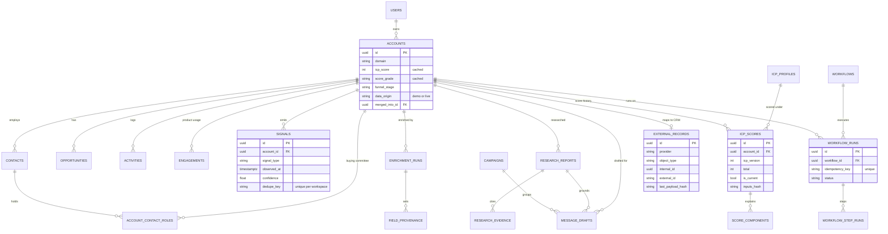

# GTMOS Data Model

This document describes the Postgres schema behind GTMOS. The source of truth is the SQLAlchemy 2 models in `apps/api/src/gtmos/models/` (`core.py`, `crm.py`, `intelligence.py`, `outbound.py`, `ops.py`). The Alembic migrations in `apps/api/migrations/versions/` are generated from them. The schema has 41 tables in five domains:

| Domain | Module | Tables |
|---|---|---|
| Tenancy | `core.py` | `workspaces`, `users` |
| CRM | `crm.py` | `accounts`, `contacts`, `account_contact_roles`, `pipeline_stages`, `stage_transitions`, `opportunities`, `activities`, `engagements` |
| Intelligence | `intelligence.py` | `icp_profiles`, `icp_scores`, `score_components`, `signal_types`, `signals`, `enrichment_runs`, `enrichment_attempts`, `field_provenance`, `research_reports`, `research_evidence` |
| Outbound and experiments | `outbound.py` | `campaigns`, `sequences`, `sequence_steps`, `message_drafts`, `experiments`, `experiment_variants`, `experiment_assignments`, `experiment_outcomes` |
| Automation, ops and governance | `ops.py` | `workflows`, `workflow_runs`, `workflow_step_runs`, `routing_rules`, `routing_decisions`, `integrations`, `integration_syncs`, `external_records`, `webhook_events`, `audit_events`, `data_quality_issues`, `simulated_crm_objects` |

## Conventions

- **Primary keys.** Every table uses a UUID `id` from `IdMixin` (`Uuid` column, default `uuid.uuid4`). Seed data overrides this with deterministic ids (see [Design choices](#design-choices)).
- **Timestamps.** Mutable business entities use `TimestampMixin`, which adds `created_at` and `updated_at` (timezone-aware, server default `now()`, and `updated_at` bumped on update). Append-only records such as signals, runs, syncs, webhook events and audit events carry their own domain timestamps (`observed_at`, `received_at`, `occurred_at`, `started_at`) instead.
- **Tenancy.** Almost every table has `workspace_id → workspaces.id ON DELETE CASCADE`. Child tables that only make sense under a parent (`score_components`, `enrichment_attempts`, `research_evidence`, `sequence_steps`, `workflow_step_runs`, `experiment_*`) reach the workspace through that parent instead.
- **JSON.** `dict`/`list` columns map to `JSONB` on Postgres (`JSON().with_variant(JSONB(), "postgresql")`), so the test suite can still run on other dialects.
- **Constraint names** follow a fixed naming convention (`pk_%(table)s`, `uq_%(table)s_%(col0)s`, `fk_…`, `ix_…`), so Alembic autogenerate produces stable, diffable migrations.
- **Enumerations** are plain `String` columns with the allowed values documented in code comments and module constants (`FUNNEL_STAGES`, `DEAL_STAGES`, `LIFECYCLE_STAGES`, `BUYING_ROLES`, `MESSAGE_STATUSES`, `WORKFLOW_RUN_STATUSES`, `STEP_STATUSES`). They are validated in the domain and API layers, not with database CHECK constraints. That keeps adding a value a code change, not a migration.

## Core entity diagram

The diagram shows the main entities and their foreign keys. Tenancy (`workspace_id` on nearly every table) is left out to keep it readable.

`external_records.internal_id` is a polymorphic reference (an account, contact or opportunity id, depending on `object_type`), not a declared foreign key. The same holds for `entity_id` columns in `stage_transitions`, `enrichment_runs`, `field_provenance`, `audit_events` and `data_quality_issues`.

---

## Tenancy

### `workspaces`
One tenant, which is one selling organization. `slug` is unique. `seller_name` and `seller_product` describe what the workspace sells; research and personalization use them as context. `mode` (`demo` | `live`) drives the persistent DEMO banner in the UI. `demo_anchor_at` is the instant the seed data was generated relative to. Relative windows such as "signals in the last 30 days" stay meaningful because the synthetic history is anchored to it.

### `users`
GTM team members who own accounts or operate the system. `role` is one of `ae | senior_ae | sdr | am | revops | admin`. `team`, `territory` (`NA | EMEA | APAC | LATAM`) and `capacity` feed routing (`pool_least_loaded`). `UNIQUE (workspace_id, email)`. V1 has no login, so users are routing targets and owners, not authenticated principals.

---

## CRM

### `accounts`
The central entity: a target company.

- **Firmographics:** `name`, `domain`, `industry`, `sub_industry`, `employee_count`, `employee_growth_12m` (a fraction), `annual_revenue_usd`, `founded_year`, `country` (ISO alpha-2), `region`, `city`.
- **Funding:** `funding_stage`, `total_funding_usd`, `last_funding_at`, `last_funding_amount_usd`.
- **Technographics:** `technologies` (JSONB list), `ai_team_size`, `ai_open_roles`.
- **GTM state:** `segment` (`strategic | enterprise | mid_market | smb`), `funnel_stage` (default `prospect`), `lifecycle_stage` (HubSpot-compatible, default `lead`), `is_customer`, `owner_id → users` (`SET NULL`).
- **Cached score:** `icp_score`, `score_grade` (`A | B | C | D | X`, where X means excluded), `intent_score`, `score_updated_at`, `last_signal_at`, `last_enriched_at`.
- **Identity and dedupe:** `merged_into_id → accounts.id` (`SET NULL`). A merged account stays as a tombstone pointing at the survivor. Almost every query filters `merged_into_id IS NULL`.
- **CRM link:** `hubspot_company_id`, which is set only by a live (non-simulated) sync.
- **Provenance:** `source` (default `demo_seed`), `data_origin`, `is_flagship` (the hand-authored demo accounts).

Indexes: `(workspace_id, icp_score)` for ranked list views, and `(workspace_id, domain)` for domain matching (signals, PostHog events, n8n payloads). Domain is **not** unique at the database level. Duplicates are a data-quality condition that the DQ rules detect and the merge flow fixes, not a constraint violation. That matches how real CRMs behave.

### `contacts`
People at accounts: name, `email`, `email_status` (`valid | invalid | risky | unknown`), `title`, `seniority` (`c_suite | vp | director | manager | ic`), `department`, `persona`, `linkedin_url`, `country`, `lifecycle_stage`, `owner_id`, `do_not_contact`, `merged_into_id`, `hubspot_contact_id`, plus `source`, `data_origin` and `last_enriched_at`. `account_id` is nullable (`SET NULL`) so an unmatched lead can exist. Indexes: `(workspace_id, email)` and `(account_id)`.

### `account_contact_roles`
The inferred buying committee. Each row places a contact in a `role` (`champion | technical_evaluator | economic_buyer | executive_sponsor | end_user`) with `rank` (1 = primary holder), `score`, `confidence` and `rationale` (a JSONB list of human-readable reasons). `is_manual_override` and `overridden_by` let a rep pin an assignment so that recomputation keeps it. `UNIQUE (account_id, contact_id, role)`.

### `pipeline_stages`
The stage catalog for the two pipelines: `pipeline = funnel` (the account GTM funnel: prospect → contacted → engaged → qualified → meeting → opportunity → won/lost) and `pipeline = deal` (discovery → evaluation → proposal → negotiation → closed_won/closed_lost). Each stage has `position`, `probability`, `is_closed` and `is_won`. `UNIQUE (workspace_id, pipeline, key)`.

### `stage_transitions`
Append-only history of every funnel or deal stage change: `entity_type` (`account | opportunity`), `entity_id`, `pipeline`, `from_stage`, `to_stage`, `changed_at`, `changed_by`, `reason`. Index `(entity_type, entity_id)`. See [Design choices](#stage-history-instead-of-mutable-stage-only).

### `opportunities`
Deals: `stage` (deal pipeline), `amount_usd` (`Numeric(14,2)`), `opened_at`, `expected_close_date`, `closed_at`, `owner_id`, `primary_contact_id`, `source_campaign_id → campaigns` (for attribution), `lead_source` (`outbound | inbound | plg | partner`), `lost_reason`, `data_origin` and `hubspot_deal_id`. Index `(workspace_id, opened_at)`.

### `activities`
Sales touches and outcomes: email events, replies, calls, meetings, tasks, notes and internal notifications. It links to `account_id`, `contact_id`, `user_id`, `campaign_id`, `sequence_step_id` and `message_draft_id`, which is what makes attribution and experiment outcome tracking possible. `type`, `channel`, `occurred_at`, `subject`, `summary`, `status` (tasks: `open | done`), `properties` (JSONB), `source` and `data_origin`.

`dedupe_key` has a `UNIQUE` constraint. Workflow actions use it to make side effects idempotent: `create_task` keys on `task:{run_id}:{subject}` and `notify_owner` on `notify:{run_id}`, so a retried run reuses the existing row instead of creating a second task. Postgres allows many NULLs under a unique constraint, so activities without a key are unaffected. Indexes: `(account_id, occurred_at)` and `(workspace_id, type, occurred_at)`.

### `engagements`
Behavioral events (product usage and web visits), usually from PostHog: `event_name`, `distinct_id`, `occurred_at`, `properties`, `source` (`posthog | web | demo_seed`), `data_origin`, and the resolved `account_id`/`contact_id` (both nullable, because an unmatched event is still stored). `dedupe_key` is `UNIQUE` and set to `posthog:{event uuid}` on ingestion, so a re-delivered event is detected before any signal is derived. Index `(account_id, occurred_at)`, used by the pricing-page 7-day aggregation.

---

## Intelligence: scoring, signals, enrichment, research

### `icp_profiles`
Versioned ICP definitions. `definition` is a JSONB document validated by `domain.icp.ICPDefinition` (weights, fit rules, exclusions, grade thresholds). `version`, `is_active` and `created_by` are stored with it. Changing the ICP through `PUT /icp` writes a new version and rescores. Old versions stay, so historical scores remain interpretable.

### `icp_scores`
One computed score per account per rescore: `icp_profile_id`, `icp_version`, `total`, `grade`, the five category subtotals (`fit`, `intent`, `timing`, `technical`, `engagement`), `excluded` and `exclusion_reason`, `summary`, `inputs_hash`, `computed_at`, `trigger` (for example `signal:funding_round`, `workflow:<run id>`, `icp:v3`) and `is_current`. Rescoring flips previous rows to `is_current = false` and inserts new ones. History is never deleted. Index `(account_id, is_current)`.

`inputs_hash` fingerprints the facts that went into the score, so "why did this change?" can be answered by comparing two rows.

### `score_components`
The explanation rows for a score: `category`, `key`, `label`, `points`, `max_points`, `explanation` and `evidence` (a JSONB list pointing at the facts or signals that earned the points). The UI score breakdown is rendered from these rows, not recomputed.

### `signal_types`
The signal catalog (`key` unique, `name`, `category`, `default_strength`, `half_life_days`, `description`). It mirrors `domain.signals.SIGNAL_TYPES`, which is the runtime authority. Ingestion validates against the in-code catalog.

### `signals`
Observed, timestamped buying signals such as funding rounds, executive hires, AI hiring surges, product sign-ups, pricing-page visits and usage thresholds.

- `signal_type`, `title`, `explanation`, and `evidence` (JSONB: the raw facts, for example the PostHog event id and properties).
- **Provenance:** `source` (for example `posthog`, `n8n:funding-feed`, `manual`), `source_url`, `observed_at` (when it happened in the world), `ingested_at` (when GTMOS learned of it), `confidence` (0 to 1: how sure we are that it is real), `strength` (0 to 1: how much it matters for intent; defaults to the type's `default_strength`), `data_origin`.
- **Dedupe:** `UNIQUE (workspace_id, dedupe_key)`. The key is `"{type}:" + sha256("{type}|{account domain}|{source_ref}")[:32]`, where `source_ref` is the stable id of the real-world event. The same funding round reported by two feeds, or one webhook delivered twice, becomes one signal. Duplicates are acknowledged and trigger nothing: no rescore and no workflows.

Indexes: `(account_id, observed_at)` and `(workspace_id, observed_at)`. Scoring applies exponential time decay by `half_life_days` at read time. Stored strength is never mutated.

### `enrichment_runs`
One waterfall execution for one entity: `entity_type`/`entity_id`, `status` (`succeeded | partial | failed`), `fields_requested`, `fields_filled`, `fields_changed`, `total_cost_credits`, `trigger` and `is_simulated`. Index `(entity_type, entity_id)`.

### `enrichment_attempts`
One provider answer for one field inside a run: `field`, `provider`, `position` (order in that field's waterfall), `outcome` (`hit | miss | low_confidence | error | skipped`), `value` (JSONB), `confidence`, `latency_ms`, `cost_credits` and `error`. Misses and errors are recorded too, which is how provider coverage and cost per filled field can be measured.

### `field_provenance`
The *current* provenance of each enrichable field on an account or contact: `value`, `source` (provider key, `manual`, `crm` or `seed`), `confidence`, `observed_at`, `enrichment_run_id` and `is_manual_lock`. `UNIQUE (entity_type, entity_id, field)`, so there is exactly one row per field. The enrichment merge policy reads it: a locked field is never overwritten; a different value replaces the existing one only if it is at least 0.1 more confident, or if the existing value is older than 180 days and the new one is at least as confident.

### `research_reports`
Account research briefs. They are always draft artifacts and never written to the CRM as fact. `status` (`draft | reviewed | rejected`), `generator` (`demo-deterministic` or `anthropic:<model>`), `prompt_version`, `sections` (JSONB claims per section, each citing evidence refs), `unsupported_claims` (claims stripped by citation validation), `input_hash`, `created_by`, `reviewed_by`/`reviewed_at` and `latency_ms`. Index `(account_id, created_at)`.

### `research_evidence`
The numbered evidence a report may cite (`ref` = `E1`, `E2`, …): `kind` (`signal | firmographic | technographic | activity | …`), `label`, `detail`, `source`, `source_url`, `source_record_type`/`source_record_id` (a back-pointer to the row the fact came from), `observed_at` and `confidence`. A claim whose refs do not resolve to a row here is removed.

---

## Outbound and experiments

### `campaigns`
A GTM motion with a stated `hypothesis`, `target_segment` (JSONB filter), `persona`, `trigger_signal`, `channel`, `value_prop`, dates, `owner_id`, `status` (`draft | active | paused | completed`) and `data_origin`. Campaigns are what opportunities (`source_campaign_id`) and activities attribute to.

### `sequences` and `sequence_steps`
A campaign's cadence. A sequence can carry a `variant_key` when it implements an experiment arm. Steps have `step_number`, `channel` (`email | linkedin | call | task`), `delay_days`, `subject_template` and `body_template`. `UNIQUE (sequence_id, step_number)`.

### `message_drafts`
Evidence-grounded personalized messages. Status moves `draft → review → approved → ready` (or `rejected`). **READY is the hand-off point; GTMOS never sends.** Columns: `channel` (`email | linkedin | call_prep`), `subject`, `body`, `angle`, `reasoning_chain` (JSONB: signal → pain → value → evidence → CTA), `evidence`, `guardrails` (JSONB list of `{check, passed, detail}`), `generator`, `version`, the review fields (`reviewed_by`, `approved_by`, `approved_at`, `rejection_reason`), links to `account`, `contact`, `campaign` and `research_report`, and `workflow_run_id`. The `draft_outreach` workflow action looks up drafts by `workflow_run_id` before creating any, so a retried run creates drafts at most once. Index `(workspace_id, status)` backs the approval queue.

### `experiments`, `experiment_variants`, `experiment_assignments`, `experiment_outcomes`
Outbound A/B tests with pre-registered hypotheses.

- `experiments`: `hypothesis`, `null_hypothesis`, `primary_metric` (`reply | positive_reply | meeting | opportunity`), `unit` (default `contact`), `status`, `salt` (for deterministic hash bucketing), `min_sample_per_variant`, `campaign_id`, start and end, `data_origin`.
- `experiment_variants`: `key`, `is_control`, `weight`, optional `sequence_id`. `UNIQUE (experiment_id, key)`.
- `experiment_assignments`: `unit_id`, `variant_id`, `bucket`, `assigned_at`, `exposed_at`. `UNIQUE (experiment_id, unit_id)` guarantees a unit is never in two arms.
- `experiment_outcomes`: `metric`, `value`, `occurred_at`, `source_activity_id`. `UNIQUE (assignment_id, metric)`, so an outcome is counted at most once per unit.

---

## Automation, operations and governance

### `workflows`
TRIGGER → CONDITIONS → ACTIONS definitions. `key` is `UNIQUE (workspace_id, key)`. `trigger_type` (`signal.created`, `product.pql`, `score.threshold_crossed`, `manual`), `definition` (JSONB validated by `domain.workflows.WorkflowDefinition`: trigger filters, conditions, and ordered steps with `max_attempts` and `continue_on_failure`), `is_enabled` and `version`.

### `workflow_runs`
One execution of a workflow version for one trigger event: `workflow_version`, `account_id`, `trigger_event` (JSONB snapshot of the triggering context), `condition_results` (each condition with pass/fail), `status` (`queued | running | succeeded | failed | skipped | dead_letter`), `error`, `attempt`, `correlation_id`, the timestamps and `data_origin`.

`idempotency_key` is `UNIQUE`. Its value is `wf:{workflow_key}:v{version}:{trigger_type}:{event_id}`, where the event id is usually the signal id. The engine checks for an existing key first and then inserts inside a savepoint. If a concurrent delivery wins the race, the `IntegrityError` is caught and the duplicate returns no run. Postgres enforces "one run per workflow version per event", not the application. Note that the key does not include `workspace_id`. That is safe because event ids are UUIDs, but it is a global uniqueness scope. Indexes: `(workspace_id, created_at)` and `(account_id)`.

### `workflow_step_runs`
Persisted per-step state: `step_key`, `position`, `action`, `status` (`pending | running | succeeded | failed | skipped | retrying`), `attempts`/`max_attempts`, `input`, `output`, `error`, `logs` (a JSONB list of timestamped entries), timing. `UNIQUE (run_id, step_key)`. Retrying a run resets only failed steps, and steps skipped because of them, back to `pending`. Succeeded steps are not re-executed.

### `routing_rules` and `routing_decisions`
Rules have `priority` (lower wins), `conditions` (JSONB list of `{field, op, value}`), `assign_strategy` (`user | pool_least_loaded`), `assign_user_id`/`assign_team`, and `overrides_existing_owner`. Each decision records `outcome` (`assigned | kept_owner | unmatched`), `assigned_user_id`, `previous_owner_id`, `matched_rules`, `conflicts`, `explanation`, `trigger`, `latency_ms` (signal-to-decision time when a signal triggered it) and `applied`. Index `(account_id, decided_at)`.

### `integrations`
One row per provider per workspace (`UNIQUE (workspace_id, provider)`): `category`, `mode` (`demo | live | disabled`), `status` (`healthy`, `degraded`, `not_configured`, …), `config` (non-secret settings only; secrets live in environment variables) and the last success and error. The reverse-ETL job updates health after each run.

### `integration_syncs`
The sync log: one row per sync job run. `provider`, `job` (for example `reverse_etl_companies`, `workflow_crm_upsert`), `direction`, `object_type`, `status` (`running | succeeded | partial | failed`), `is_simulated`, counts (`records_considered`, `records_changed`, `records_succeeded`, `records_failed`, `records_skipped`, `retries`), `errors` (the first 50), `correlation_id`, timing and `trigger`. Index `(workspace_id, started_at)`.

### `external_records`
The mapping from a GTMOS record to its id in an external system, plus what was last pushed: `provider`, `object_type`, `internal_id`, `external_id`, `last_payload_hash` (sha256 of the canonical JSON payload), `last_payload`, `last_synced_at`, `remote_updated_at` and `is_simulated`.

`UNIQUE (provider, object_type, internal_id)` makes this the backbone of idempotent sync. Each GTMOS record has at most one mapping per destination object type. Unchanged payloads are skipped by comparing the hash, and `last_payload` gives the field-level diff shown in the reverse-ETL preview. Index `(provider, object_type, external_id)` supports reverse lookup from inbound CRM webhooks.

### `webhook_events`
Every inbound webhook delivery is stored raw before processing: `source` (`posthog | n8n | hubspot | generic`), `event_type`, `signature_status` (`valid | invalid | not_configured`), `payload`, `status` (`received`, `processed`, `failed`, `rejected`, `dead_letter`), `duplicate_count`, `result`, `error`, `attempts`, `correlation_id`, `received_at`, `processed_at`, `processing_ms` and `data_origin`.

`UNIQUE (source, idempotency_key)`. The key is taken from an `Idempotency-Key` / `X-Idempotency-Key` header, else from the payload's `uuid`, `event_id`, `eventId` or `id`, else from `sha256(body)`. A re-delivery increments `duplicate_count` and returns the original result. A *rejected* delivery does not count as seen: a later, correctly signed delivery with the same key is re-evaluated in place, so an unsigned copy cannot pre-empt a legitimate event. Index `(workspace_id, received_at)`.

### `audit_events`
Append-only governance log: `actor_type` (`user | system | workflow | integration`), `actor`, `action` (for example `signal.ingested`, `workflow.run_succeeded`, `integration.synced`), `entity_type`/`entity_id`, `before`/`after` JSONB snapshots, `reason`, `correlation_id` and `occurred_at`. Indexes: `(entity_type, entity_id)` and `(workspace_id, occurred_at)`. The correlation id ties an audit row to the webhook event, workflow run or sync that caused it.

### `data_quality_issues`
Findings from the data-quality rules (duplicates, invalid emails, missing owners, invalid stage transitions, and so on): `rule_key`, `severity` (`high | medium | low`), `entity_type`/`entity_id`, `related_ids`, `title`, `details`, `suggested_fix` (JSONB `{action, params, description}`), `status` (`open | resolved | ignored`), `detected_at`, `last_seen_at`, `resolved_at` and `resolved_by`.

`UNIQUE (workspace_id, fingerprint)`, where `fingerprint = sha256("{rule_key}|{entity_type}|{key or entity_id}")[:40]`. Re-running a scan updates `last_seen_at` and the details on the existing issue instead of creating duplicates. If a `resolved` issue is detected again it reopens. An `ignored` issue stays ignored. An `open` issue that is no longer detected is auto-resolved (`resolved_by = "scan: no longer detected"`). Index `(workspace_id, status, rule_key)`.

### `simulated_crm_objects`
What the demo HubSpot adapter "stores" in place of a real portal: `object_type` (`companies | contacts | deals | notes | tasks`), `external_id` (a deterministic fake HubSpot id), `unique_key` (the value upserted on; for companies this is the GTMOS account id) and `properties`. `UNIQUE (workspace_id, object_type, external_id)`. The UI reads this table to show the remote side of a simulated sync, labeled SIMULATED.

---

## Design choices

### UUID ids, deterministic for seed data
UUIDs let services create ids before insert, work across systems (the account id *is* the `gtmos_account_id` HubSpot property), and avoid leaking row counts. Seed data does not use random UUIDs. The generator derives them with `uuid5(NS, f"{kind}:{key}")` (for example `uid("step", "funding-vs-generic:b:2")`) on a fixed namespace, with a fixed RNG seed. Reseeding therefore produces identical ids, so screenshots, demo scripts, tests and deep links stay valid across resets, and the simulated enrichment providers (which answer from the same deterministic universe) agree with the seeded accounts.

### JSONB for rules, definitions and evidence
ICP definitions, workflow definitions, routing conditions, score evidence, signal evidence, research sections, reasoning chains and guardrail results are JSONB. These structures are versioned documents that are always read and written whole, and they change shape as rules evolve. Each is validated by a Pydantic model in `domain/` at the boundary, so the database stores data that is already validated, and new rule types need no migration. Anything that is filtered, joined or sorted on (score, grade, stage, owner, status, timestamps) is a real column.

### Cached score columns vs `icp_scores` history
`icp_scores` plus `score_components` are the source of truth: every score ever computed, with its ICP version, trigger and explanation. List views, sorting and filtering by score across thousands of accounts would need a lateral join to the current score row on every request. So `accounts.icp_score`, `score_grade`, `intent_score` and `score_updated_at` are a denormalized cache, written in the same transaction as the new `icp_scores` row, and they back the `(workspace_id, icp_score)` index. Only `rescore_accounts` writes them. The CRM sync pushes these cached values.

### `data_origin`: demo vs live
Every GTM record that could be mistaken for real data (accounts, contacts, opportunities, activities, engagements, signals, campaigns, experiments, workflow runs, webhook events) carries `data_origin` = `demo` (synthetic seed) or `live` (arrived through a real integration or a user action). The UI renders a DEMO badge from it, and analytics can exclude demo rows. Records created by live ingestion (the PostHog webhook, n8n signals, `POST /signals`) are `live` even inside a demo workspace. Simulation at the integration layer is tracked separately with `is_simulated` on `enrichment_runs`, `integration_syncs` and `external_records`.

### Stage history instead of mutable stage only
`accounts.funnel_stage` and `opportunities.stage` hold the current state, and every change also appends a `stage_transitions` row, written by `crm_service.change_funnel_stage` and the deal-stage equivalent. Funnel conversion rates, stage velocity (time in stage), and the "invalid transition" data-quality rule all need history that a single mutable column cannot provide. They are computed from this table rather than reconstructed from audit logs.

### Field-level provenance
`field_provenance` answers "where did this employee count come from, when, and how sure are we?" for each field, not each record. The enrichment merge policy depends on it (manual locks, confidence upgrades, staleness), and the account page shows it. Together with `enrichment_attempts`, the system can explain both the current value and the alternatives that were rejected.

### No ORM relationships: explicit queries
The models declare foreign keys but no `relationship()` attributes. Every read is an explicit `select()` in a service function. That keeps query count and shape visible in code review, rules out accidental N+1 lazy loads in list endpoints, and makes the bulk paths (rescoring thousands of accounts, sync planning) batch queries by design. Sessions are created with `autoflush=False` and `expire_on_commit=False`, so nothing hits the database implicitly.

The consequence is **flush ordering**. Without relationships, SQLAlchemy's unit of work does not know that a `SequenceStep` depends on its `Sequence`, so it cannot sort inserts by dependency. Code that creates a parent and its children in one transaction must call `db.flush()` after adding the parents. Otherwise Postgres can see the child insert first and raise a foreign-key violation. You will see this throughout the seed generator (`c.db.flush()  # no ORM relationships, so enforce FK insert order explicitly`) and in services such as `create_run`, which flushes the `WorkflowRun` inside a savepoint before adding its `WorkflowStepRun` rows, and `run_company_sync`, which flushes the `IntegrationSync` row before any work references its id. New code must follow the same pattern.

### Idempotency lives in the database
Each place where a duplicate would be harmful has a unique constraint rather than only an application check:

| Concern | Constraint |
|---|---|
| Same real-world signal ingested twice | `signals (workspace_id, dedupe_key)` |
| Same PostHog event delivered twice | `engagements (dedupe_key)` |
| Same webhook re-delivered | `webhook_events (source, idempotency_key)` |
| Workflow run twice for one event | `workflow_runs (idempotency_key)` |
| Workflow side effect repeated on retry | `activities (dedupe_key)`, drafts keyed by `workflow_run_id` |
| CRM record created twice | `external_records (provider, object_type, internal_id)` plus upsert on `gtmos_account_id` |
| DQ issue reported twice | `data_quality_issues (workspace_id, fingerprint)` |
| Unit in two experiment arms | `experiment_assignments (experiment_id, unit_id)` |

The application checks first so it can return a friendly "duplicate" response. The constraint is what holds under concurrent deliveries.
