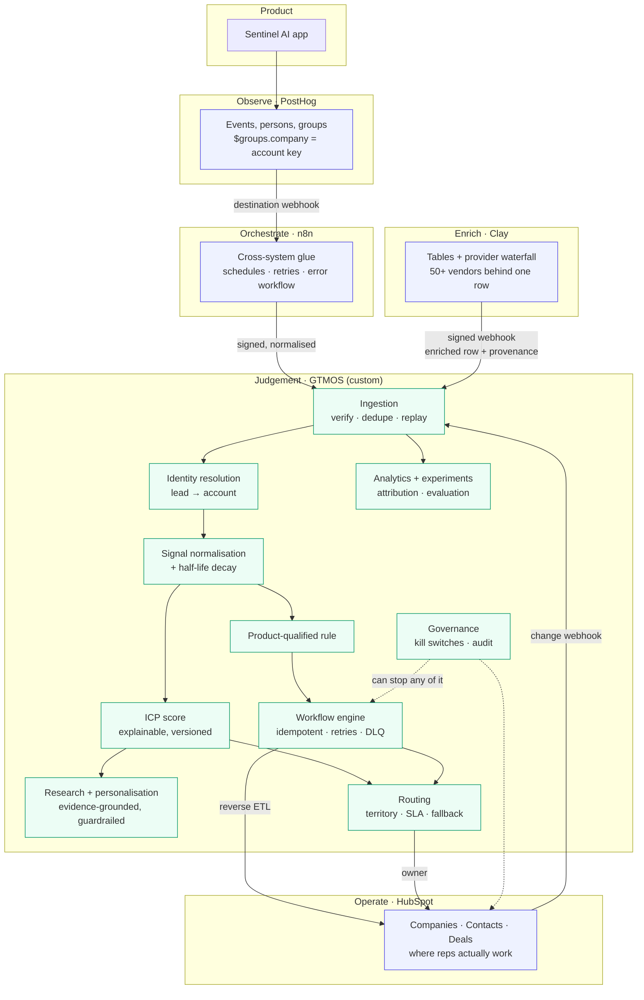

# Phase 3 architecture: what each tool owns, and why

The temptation in a portfolio project is to rebuild everything, so the README can claim the system
"replaces" a stack of well-funded products. That is the wrong instinct and an interviewer will spot it
in a minute: nobody hiring a GTM engineer wants someone who reimplements Clay badly. The job is to know
what to buy, what to orchestrate, and what to build — and to be able to defend each line.

This document is the boundary decision. It is deliberately opinionated.

---

## The one-sentence version

**PostHog** observes the product, **Clay** buys commodity enrichment, **n8n** glues systems together,
**HubSpot** is where the revenue team works, and **GTMOS** owns the judgement: what a signal means, what
an account is worth, who should work it, what may be said to them, and whether any of it worked.

## The diagram

---

## Ownership, tool by tool

### PostHog owns product behaviour

**Why buy it.** Event ingestion at volume, person and group identity, session context, and a query
layer are solved problems with a well-understood cost curve. Rebuilding capture and storage is weeks of
work that produces a worse PostHog.

**What GTMOS takes from it.** Events, and specifically the **group key** — PostHog's `$groups` maps a
group type to a group key, and that key is what lets a product event become an *account* fact rather
than a user fact. B2B GTM is account-shaped; a product analytics tool that only knows users is not
usable for it.

**What GTMOS does not delegate.** What the behaviour *means*. PostHog can tell you three people from
one domain connected an integration; it has no opinion about whether that is worth a rep's afternoon.
`domain/pql.py` holds that opinion, at the account level, as a composite rule with weights someone can
argue with.

**The constraint that shaped the design.** Group analytics is a paid add-on and the outbound HTTP
webhook destination appears to be gated too (see `docs/research/posthog.md`). So GTMOS accepts
PostHog's payload shape at a boundary it controls, and the same endpoint works whether the events come
from PostHog Cloud, from n8n, or from a replay script. That is also just better engineering: the
ingestion contract should not depend on who is calling it.

### Clay owns commodity enrichment

**Why buy it.** Clay's value is the provider network — dozens of data vendors behind one interface,
with a waterfall that tries them in order and only pays for the one that answers. Recreating that means
negotiating with vendors, not writing code. GTMOS already implements a waterfall over three simulated
providers to prove the *mechanics* are understood, and that is exactly the point at which you should
stop and buy the real thing.

**What GTMOS takes from it.** Enriched account and contact records, and critically the **provenance**:
which provider supplied each value, when, and with what confidence.

**What GTMOS does not delegate.** The **merge policy**. Clay tells you what a provider said; it does
not decide whether that should overwrite what you already believe. GTMOS's `domain/enrichment.py`
refuses to overwrite a manual lock, refuses to resolve a material disagreement on confidence alone, and
raises a data-quality issue instead. A Clay value enters through the same policy as any other provider —
it gets no special authority for having been bought.

**Honest status.** No Clay account exists for this project, nothing was purchased, and the integration
has **not** been run against a live Clay workspace. The boundary is built against Clay's documented
Public API and signed-webhook contract and tested locally against that contract. See
`docs/clay-live-setup.md`.

### n8n owns cross-system orchestration

**The obvious objection: GTMOS has a workflow engine — why also run n8n?** Because they do different
jobs, and conflating them is how teams end up with business logic scattered across a canvas nobody can
test.

| | GTMOS workflow engine | n8n |
|---|---|---|
| Runs | GTM *semantics*: score → qualify → research → draft → route → sync | *Plumbing* between systems |
| Lives in | Version-controlled Python with unit tests | A visual canvas a RevOps person can edit |
| Guarantees | Idempotency keys, persisted step state, row-locked execution, dead letters, replay | Retries, error workflows, execution history |
| Changed by | An engineer, through a pull request | An operator, without a deploy |
| Failure blast radius | One account's run | One integration hop |

The rule: **anything that decides revenue lives in GTMOS; anything that moves bytes between systems
lives in n8n.** A scoring change should be reviewable in a diff. Adding a Slack notification should not
need one.

n8n is the one integration here that is **fully verified by execution** — it runs locally in Docker,
pinned to 2.40.5, and the workflows genuinely fire against the running API.

### HubSpot owns the operational CRM

**Why buy it.** Reps live in a CRM. Sequences, tasks, calls, forecasting, mobile, permissions — all of
it exists and none of it is differentiating to rebuild.

**What GTMOS writes.** Only its own computed fields, namespaced `gtmos_*`: the score, grade, intent,
tier, last signal, next best action, last scored timestamp. Plus name and domain **on create only**.

**What GTMOS never writes.** Anything a rep edits. The field-ownership rule is enforced in
`plan_company_sync`, not just documented: an update payload contains `gtmos_*` fields and nothing else,
so a reverse-ETL push cannot clobber a rep's correction.

**What GTMOS never reads as truth.** Inbound CRM changes are logged, never auto-applied. Applying them
automatically is how sync loops start: GTMOS writes a field, HubSpot fires a change webhook, GTMOS
applies it, which writes the field again. Breaking that cycle deliberately is more important than the
convenience of two-way sync.

**Honest status.** The live adapter is implemented against current documented APIs and **has never run
against a real portal**. Phase 3 corrected three things by reading the docs properly — private apps
sign webhooks with v1 not v3, the URI must not be unquoted before signing, and the association type IDs
1/2/5/6 are the *primary* variants. See `docs/research/hubspot.md` and `docs/hubspot-live-setup.md`.

### GTMOS owns everything that constitutes a judgement

Concretely: the ICP and its versions; the score and its explanation; signal normalisation, decay and
disqualification; identity resolution; the product-qualified rule; buying-committee inference;
evidence-grounded research and the guardrails on generated text; routing with territories, SLAs and a
fallback queue; the workflow semantics; experimentation with guardrail metrics; attribution; data
quality; the kill switches; and the evaluation harnesses that grade all of it.

The test for whether something belongs here: **would a reasonable GTM leader want to argue with it?**
If yes, it needs to be explainable, versioned, and diffable — which means it belongs in code you own,
not in a vendor's black box or a workflow canvas.

---

## What GTMOS deliberately does **not** do

Naming these is as important as the diagram, because the failure mode of a project like this is
sprawl.

- **No email sending.** No SMTP, no sequencer, no mailbox. Drafts stop at an approval queue. A
  portfolio project that can send mail to strangers is a liability, and deliverability is modelled as a
  *constraint* (`domain/deliverability.py`) rather than an activity.
- **No enrichment vendor network.** Three simulated providers exist to prove the waterfall mechanics.
  Buy Clay.
- **No product analytics storage.** No event store, no session replay, no funnels over raw events.
- **No CRM UI.** No pipeline drag-and-drop, no task management, no mobile app.
- **No general workflow builder.** The workflow editor is definition-as-data with a read-only visual
  view. If you want a canvas, that is what n8n is for.
- **No "AI decides".** LLM output is prose over evidence GTMOS already holds, it is never a source of
  CRM truth, and it cannot be approved while a blocking guardrail fails.

## Where the data actually flows

| Hop | Payload | Trust | Verified? |
|---|---|---|---|
| Product → PostHog | events with `$groups.company` | first-party | shape verified against docs |
| PostHog → n8n | destination webhook | untrusted transport | **shape replayed and executed locally** |
| n8n → GTMOS | normalised event, HMAC-signed | authenticated | **verified end to end** |
| Clay → GTMOS | enriched row + provider metadata, `X-Clay-Signature` | untrusted content | contract tested locally, **not live** |
| GTMOS → HubSpot | `gtmos_*` properties, batch upsert on a unique key | outbound | **simulated adapter verified**; live adapter unrun |
| HubSpot → GTMOS | change webhook, JSON array, v1/v3 signature | untrusted, logged not applied | **verified with a simulated payload** |

"Untrusted content" is not a formality. Signal text and enrichment values are scraped from the outside
world and end up in a research brief a rep may paste into an email, so they pass through
`sanitize_external()` at the boundary — which was added in Phase 2 after the evaluation harness caught
the generator copying an injected instruction verbatim.

## How this changes at scale

- **At ~$1M ARR:** this shape is right, minus the warehouse. One person operates it. The kill switch
  matters more than the analytics.
- **At ~$100M ARR:** PostHog events land in a warehouse via a pipeline rather than a webhook; Clay is
  replaced or supplemented by direct vendor contracts and a golden-record service; routing gains
  working hours, PTO and escalation; the CRM becomes Salesforce and the adapter boundary is the only
  thing that changes; GTMOS becomes a service with its own on-call rota, and the scoring model becomes
  an actual model, trained on the labelled outcomes that finally exist.

The boundary that survives both is the same one: **buy the commodity, orchestrate the plumbing, own the
judgement.**
