# Screenshots

Every screen below is the running app in demo mode against the seeded **synthetic** dataset (2,006 simulated accounts, simulated CRM, deterministic AI; no external message is ever sent). Numbers are computed live from the database, but the underlying data is generated, not a real company's.

Captured at 1440x900, 2x pixel density, light mode. Pages that run past a few screens (accounts, scoring, signals, pipeline, routing, workflows, data quality, stack inspector, operations) were shot in a taller viewport rather than as a full-page ribbon, so the panels that matter stay readable.

## 1. Overview — command centre

Every headline number carries its denominator (2,006 accounts, 93% fully enriched; $5.6M pipeline created across 62 opportunities), and the cohort funnel fixes its denominator at 499 accounts first contacted in 90 days so later stages cannot be counted against a shrinking base.

## 2. Accounts

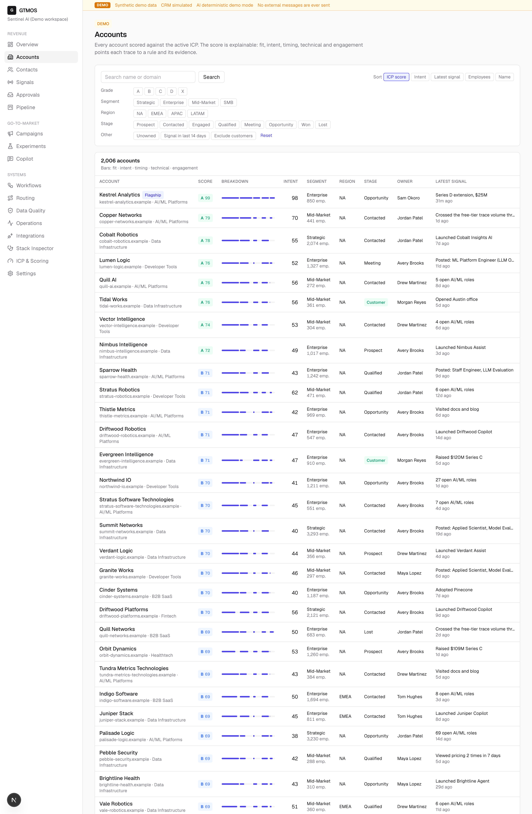

All 2,006 accounts ranked by ICP score, with the five scoring categories (fit, intent, timing, technical, engagement) drawn as a per-row breakdown bar, so the shape of a score is visible before you open the record.

## 3. Kestrel Analytics — the flagship account

The score breakdown traces every point to a named rule with its evidence, confidence, typical strength and half-life decay ("AI/ML hiring surge … 45-day half-life → 89% of 10 pts" = 8.9/10), and the provenance table records the source and confidence of each enriched field.

## 4. ICP and scoring model

The weights and signal point budgets are editable and versioned, and the "Does the score work?" panel backtests them against realised meetings — 0.537 AUC for the structural variant against 0.593 for the total score, with the +0.056 gap labelled as leakage because engagement points are downstream of the outcome being predicted.

## 5. Signals

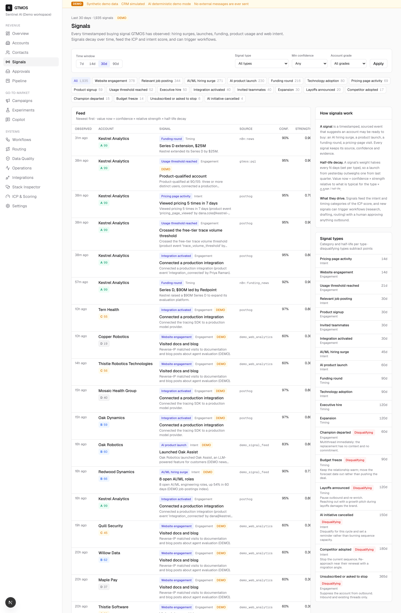

1,935 signals over 30 days, each with its source, confidence and strength, alongside the decay rules (per-type half-life and category point caps) that decide how much an old signal is still worth.

## 6. Pipeline and attribution

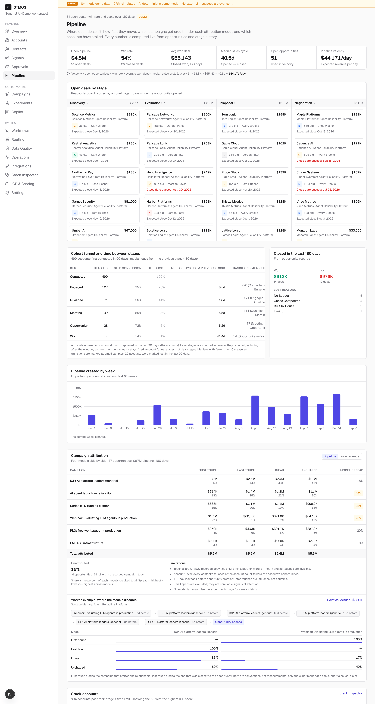

Four attribution models are shown side by side across 77 opportunities with the spread between them per campaign (up to 48%), then a worked example — one $320K Solstice Metrics deal where first touch gives a webinar 100% and last touch gives it 0% — plus an explicit note that none of these models is causal.

## 7. Experiments

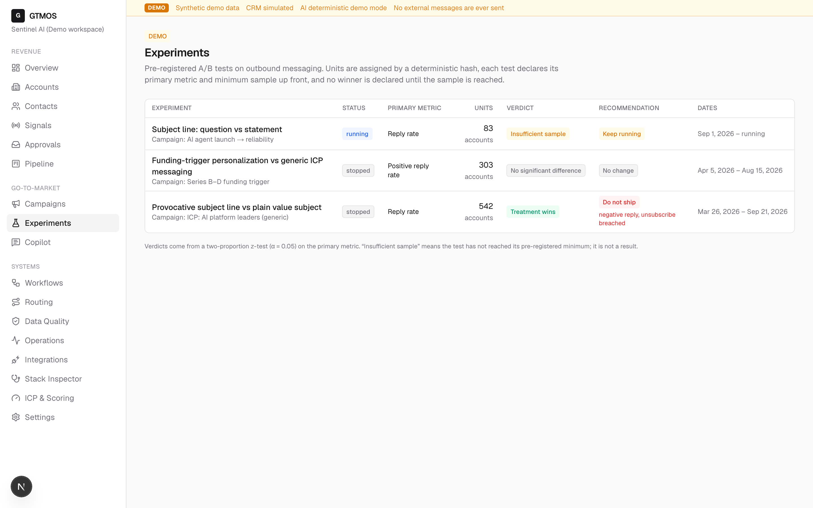

Each test declares its primary metric and pre-registered minimum sample up front; two of the three are held at "Insufficient sample" or "No significant difference" rather than being called early.

## 8. Experiment detail — a win that should not ship

The treatment beat control on reply rate by +16.3pp (p < 0.001) and the recommendation is still **do not ship**: unsubscribe rate went from 0.00% to 2.90% against a 1.00% ceiling and negative reply rate from 2.63% to 10.14%, and guardrails are checked one-sided and never traded off against the primary metric.

## 9. Routing



Seven priority-ordered rules with a stated conflict-resolution policy and a dry-run simulator, above a speed-to-first-touch panel that names the misses: 79% met the SLA, 106 touched late, 22 never touched at all, broken out per rule.

## 10. Workflows



Four event-driven workflows shown as trigger → conditions → ordered actions, with the engine guarantees stated concretely (idempotent per trigger event, resumable from the failed step, exponential backoff, dead letter) and 30-day counts that include the 7 failed and 13 dead-lettered runs.

## 11. Data quality

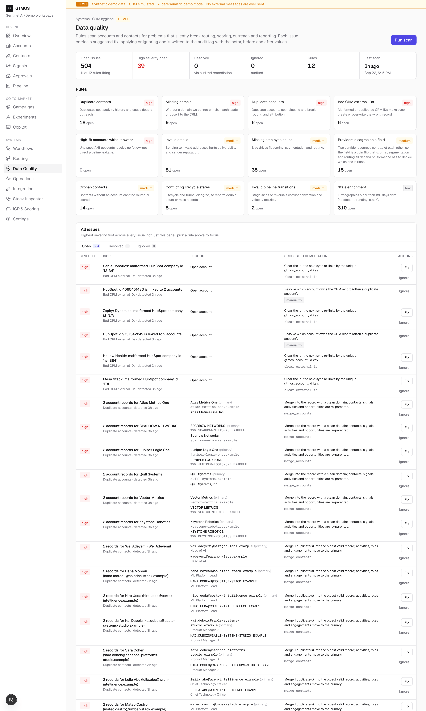

Twelve rules scanning for the defects that silently break routing and scoring — 504 open issues, 39 high severity — each with a concrete suggested remediation and a Fix/Ignore action written to the audit log with actor and before/after values.

## 12. Stack Inspector

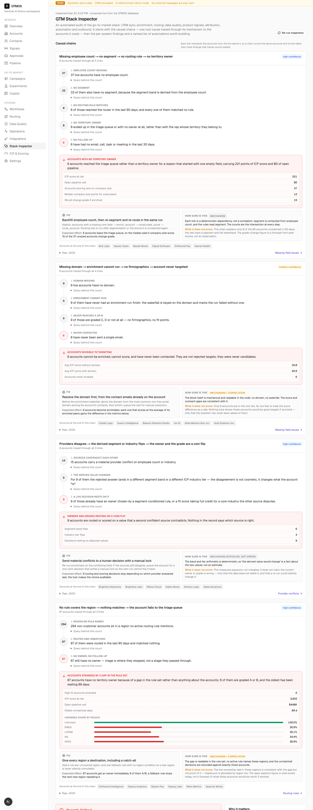

Four causal chains trace a root cause link by link to the accounts it costs (37 accounts with no employee count → 33 with no segment → 8 matched no routing rule → 6 never followed up), each with a fix, an expected effect, and an explicit "what it does not prove".

## 13. Integrations

The honest version of "what are we connected to": only n8n is verified by execution against a real running instance, HubSpot runs on a simulated adapter whose every sync is labelled SIMULATED, and PostHog and Clay are contracts exercised locally that have never exchanged a request with the real service — 1 of 4 real services reached, and nothing is labelled "Connected".

## 14. Operations

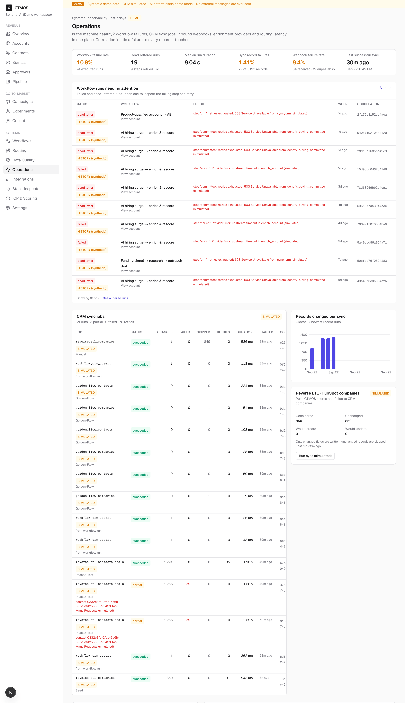

Failure-first observability: a 10.8% workflow failure rate leads the page, and each dead-lettered run names the failing step, the simulated upstream error and a correlation id that ties it to the records it touched.

## 15. Approvals

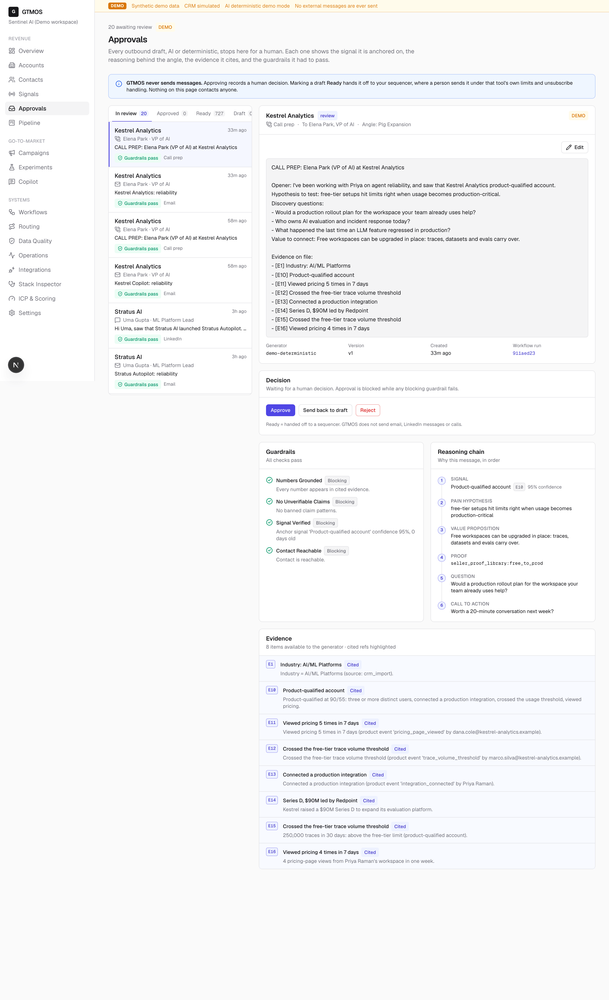

Every AI draft stops for a human with its four blocking guardrail checks (numbers grounded, no unverifiable claims, signal verified, contact reachable), its numbered reasoning chain and its cited evidence refs. The only actions are Approve, Send back to draft and Reject — there is no send button anywhere on the page.

## 16. Copilot

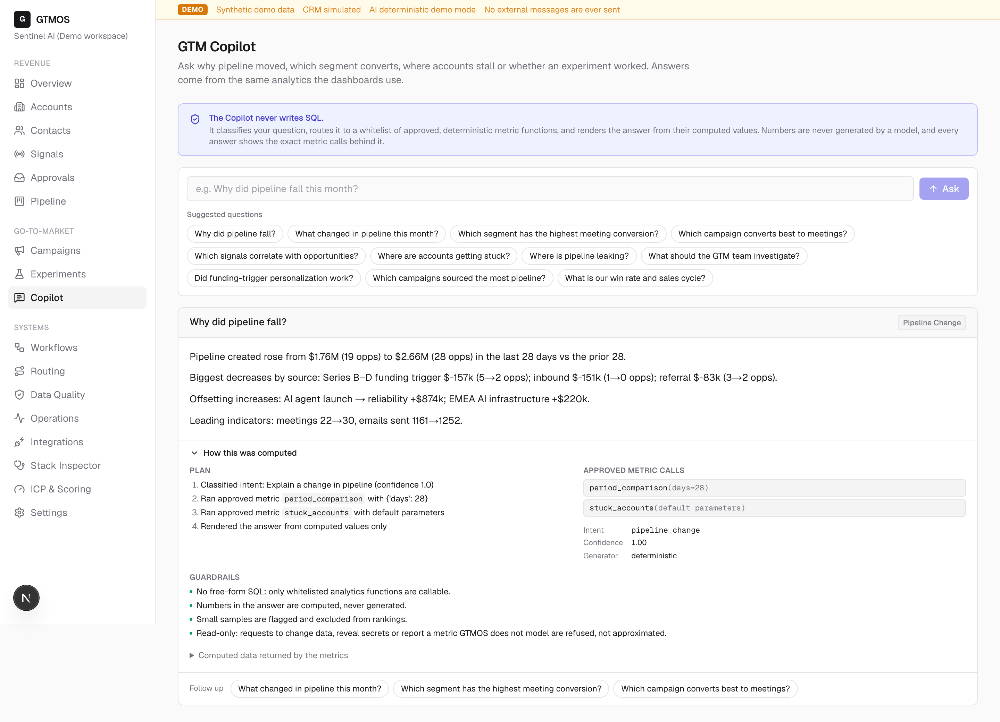

The Copilot never writes SQL: it classifies the question, routes it to a whitelist of deterministic metric functions and renders the computed values ($1.76M → $2.66M, biggest decrease Series B–D funding trigger −$157k), with "How this was computed" exposing the exact metric calls.

## 17. Settings — controls

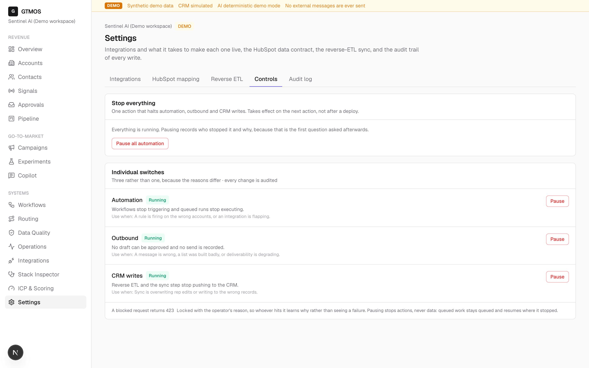

One "Pause all automation" kill switch plus three separate switches for automation, outbound and CRM writes, each with the failure it is for; a blocked request returns 423 Locked with the operator's reason, and queued work resumes where it stopped rather than being dropped.

## 18. Mobile (Pixel 7)

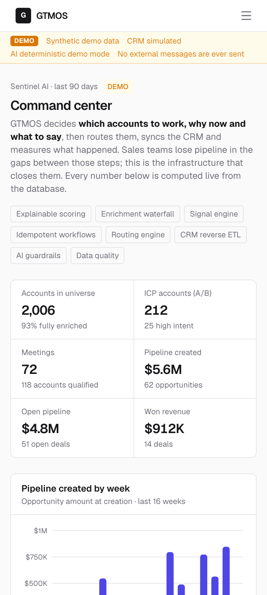

The same overview at 412x915: the sidebar collapses to a menu button, the demo banner stays visible and the metric tiles reflow to two columns without horizontal scrolling.
