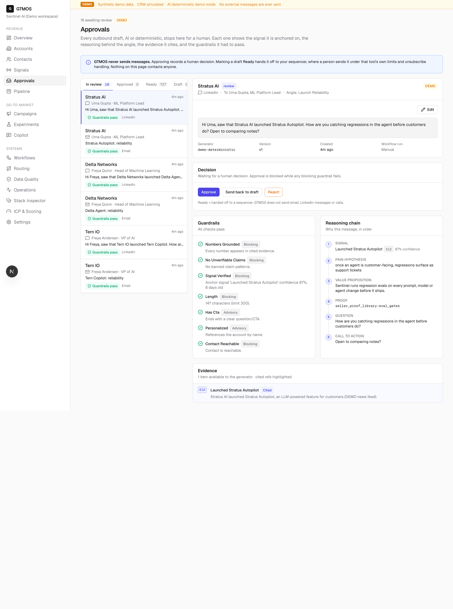
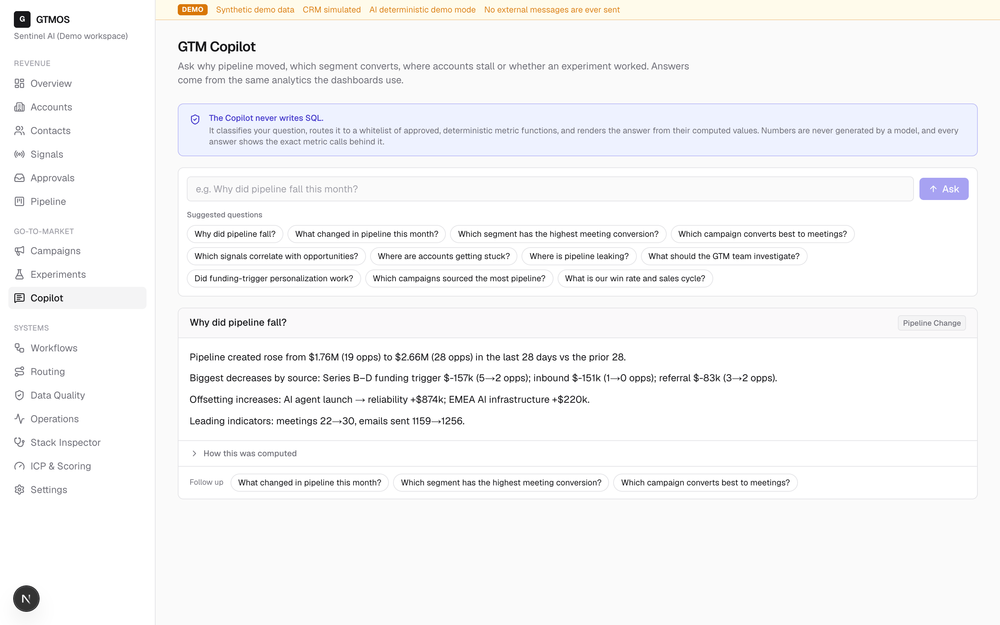
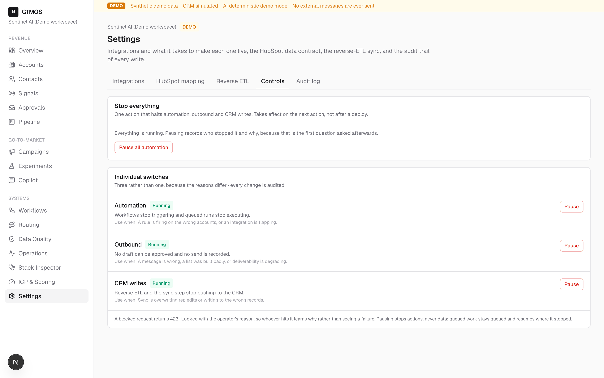
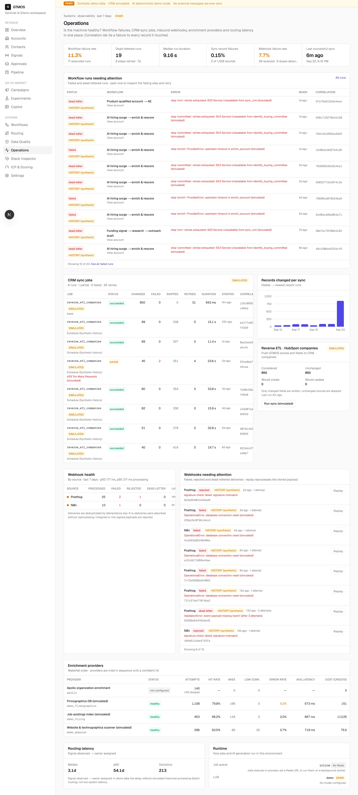
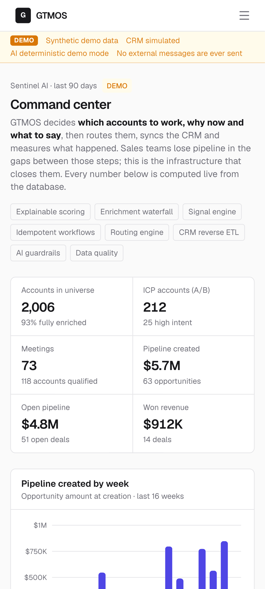

# Screenshots

Every screen below is the running app in demo mode against the seeded **synthetic** dataset (2,006 simulated accounts, simulated CRM, deterministic AI; no external message is ever sent). Numbers are computed live from the database, but the underlying data is generated, not a real company's.

Captured at 1440x900, 2x pixel density, light mode.

## 1. Overview — command centre

Every headline number carries its denominator (2,006 accounts, 93% fully enriched; $5.7M pipeline across 63 opportunities), and the system-health panel grades its own subsystems `critical`/`warning` rather than showing all green.

## 2. Accounts

All 2,006 accounts ranked by ICP score, with the five scoring categories drawn as a per-row breakdown bar so the shape of a score is visible before you open the record.

## 3. Kestrel Analytics — the flagship account

The score breakdown traces every point to a named rule with its evidence, confidence, typical strength and half-life decay (e.g. "AI/ML hiring surge … 45-day half-life → 89% of 10 pts" = 8.9/10), and the provenance table records the source and confidence of each enriched field.

## 4. ICP and scoring model

The weights and point budgets are editable and versioned, and the "Does the score work?" panel backtests them against realised meetings — reporting AUC per variant (0.537 structural vs 0.593 total) and naming the leakage and selection effects that inflate the higher number.

## 5. Signals

1,935 timestamped signals, each with source, confidence and strength, plus the decay rules (per-type half-life and point caps) that decide how much an old signal is still worth.

## 6. Pipeline and attribution

Four attribution models are shown side by side with the spread between them per campaign (up to 96%), followed by a worked example of one $320K deal where the models disagree — and the explicit note that no model here is causal.

## 7. Experiments

Each test declares its primary metric and pre-registered minimum sample; two of the three are held at "insufficient sample" or "no significant difference" rather than being called early.

## 8. Experiment detail — a win that should not ship

The treatment beat control on reply rate by +16.3pp (p < 0.001) and the recommendation is still **do not ship**: unsubscribe rate (2.90% against a 1.00% ceiling) and negative reply rate breached their guardrails, which are checked one-sided and never traded off against the primary metric.

## 9. Routing

The priority-ordered rule set with its conflict-resolution policy, a dry-run simulator, and a speed-to-first-touch panel that reports the misses by name: 79% met the SLA, 106 touched late, 21 never touched at all.

## 10. Workflows

Four event-driven workflows shown as trigger → conditions → ordered actions, with the engine guarantees stated (idempotent, resumable, retries with backoff, dead letter) and 30-day counts that include the 8 failed and 13 dead-lettered runs.

## 11. Data quality

Twelve rules scanning for the defects that silently break routing and scoring — 504 open issues, each with a concrete suggested remediation and a Fix/Ignore action that is written to the audit log with before and after values.

## 12. Stack Inspector

Four causal chains trace a root cause to its business consequence link by link (37 accounts with no employee count → 8 matched no routing rule → 6 never followed up), each with a fix, an expected effect, and an explicit "what it does not prove".

## 13. Approvals

Every AI draft stops for a human with its blocking guardrail checks (numbers grounded, no unverifiable claims, signal verified), its reasoning chain and its cited evidence. There is no send button anywhere on the page.

## 14. Copilot

The question is classified and routed to a whitelist of deterministic metric functions; the answer quotes computed values ($1.76M → $2.66M, biggest decrease Series B–D funding trigger −$157k) and exposes "How this was computed" with the exact metric calls.

## 15. Settings — controls

One "Pause all automation" kill switch plus three separate switches for automation, outbound and CRM writes; a blocked request returns 423 with the operator's reason, and queued work resumes where it stopped rather than being dropped.

## 16. Operations

Failure-first observability: an 11.3% workflow failure rate is shown first, with each dead-lettered run naming the failing step, the simulated upstream error and a correlation id that ties it to the record it touched.

## 17. Mobile (Pixel 7)

The same overview at 412x915: the sidebar collapses to a menu, the demo banner stays visible and the metric tiles reflow to two columns without horizontal scrolling.
