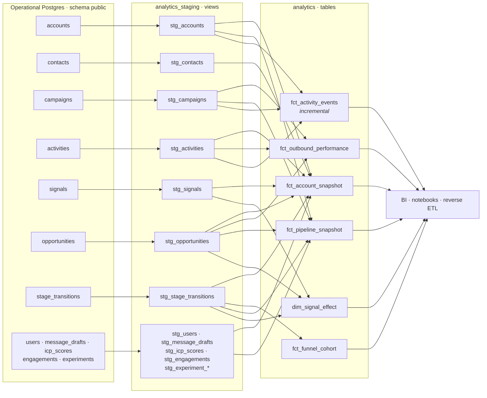
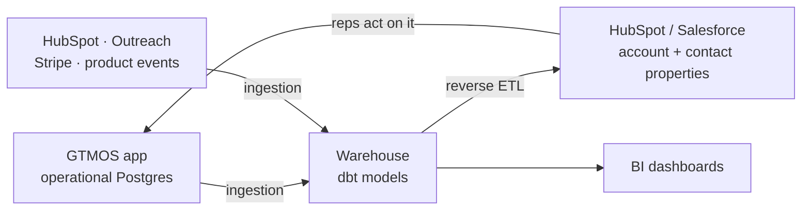

# Warehouse layer

GTMOS runs two data stores with two different jobs: an **operational database** the application
reads and writes on every request, and an **analytics warehouse** that models the same facts for
analysis and for pushing derived attributes back into the GTM stack. This document explains why both
exist, what belongs in each, and what would change if this ran on real infrastructure.

The project itself is in [`warehouse/`](../warehouse); its README covers how to run it and what each
model means.

## Why two, not one

The operational database is tuned for a transaction: find one account, write one activity, hold a
foreign key. Its schema is normalised because normalisation is what keeps writes correct. Reading a
funnel out of it means joining an append-only transition log to accounts to opportunities and
aggregating over hundreds of thousands of rows — a query shape it is the wrong shape for, run
against the same connection pool the product depends on.

The warehouse is tuned for a question: scan a wide table, group, compare. Its schema is
denormalised on purpose, because a mart that already carries `segment`, `owner_name` and
`campaign_name` lets an analyst answer "reply rate by segment by week" without knowing the join path
— or being trusted to get it right.

The split is also organisational. A metric defined in three dashboards is three metrics. Putting the
definition of "cohort funnel" in one SQL model that everything reads is the point of the warehouse
layer, more than the query performance is.

## What belongs where

| | Operational Postgres (`public`) | Warehouse (`analytics`) |
|---|---|---|
| **Owner** | The application (SQLAlchemy, Alembic migrations) | dbt |
| **Written by** | API requests, workers, webhooks | Scheduled `dbt build` only |
| **Shape** | Normalised, foreign keys, indexes for point lookups | Denormalised marts, wide tables, no foreign keys |
| **Latency** | Milliseconds, synchronous with the request | Minutes to hours behind, by design |
| **Holds** | Current state + append-only logs (activities, stage transitions, audit) | Derived facts, cohorts, rollups, historical grain |
| **Correctness** | Enforced by constraints at write time | Asserted by tests at build time |
| **Consumers** | The product | BI, notebooks, reverse ETL, the analyst |

Two rules keep the boundary honest:

1. **The warehouse never writes to `public`.** dbt has no business mutating application state. Its
   output lives in `analytics` and `analytics_staging`.
2. **Real-time decisions stay in the application.** Routing an account, scoring it, deciding whether
   a draft can be sent — those happen inside a request and read the operational database. Anything
   that needs a number computed from a million rows and can tolerate being an hour old belongs in
   the warehouse.

The API's semantic layer in `apps/api/src/gtmos/services/analytics.py` sits on the operational side:
it backs the live product surfaces, which cannot wait for a nightly build. The warehouse models
re-express those definitions in SQL, and
[the parity checks](../warehouse/README.md#parity-with-the-api) verify the two agree, metric by
metric. Two implementations of one definition is a real cost; a documented, tested pin between them
is what makes it survivable.

## Lineage

## The full pattern: operational → warehouse → back into the CRM

The warehouse is not a terminus. The loop that makes it operationally useful is:

Concretely: `fct_account_snapshot` computes a grade, a pipeline total and a days-since-last-touch per
account. A reverse-ETL tool (Census, Hightouch) syncs those as HubSpot company properties, so the
rep sees `gtmos_grade = A` and `days_since_last_touch = 34` on the record they are already looking
at, and a HubSpot workflow can act on it. The analytics layer stops being a report someone opens on
Fridays and becomes a field in the tool where the work happens.

That loop is also why cohort semantics matter so much. A funnel number that only exists in a
dashboard is an argument; a funnel number written back onto the account record drives a rep's next
action, and a wrong denominator becomes wasted calls.

GTMOS already has one leg of this: `services/crm_sync.py` pushes scores and stage changes into
HubSpot from the operational side. The warehouse-sourced properties would be the second leg —
slower, wider, and computed from more history than a request can afford to read.

## What would change on real infrastructure

| Here | Snowflake / BigQuery + Fivetran / Airbyte |
|---|---|
| Models read `public` directly through a dbt `source()` | Fivetran or Airbyte replicates `public` into a `raw_gtmos` schema on a schedule, usually by CDC off the Postgres WAL. Sources point at `raw_gtmos`; the warehouse never touches the production database. |
| One source system | Many. HubSpot, Outreach, Stripe, Salesforce and product events each land in their own raw schema, and the first real job of staging becomes identity resolution — mapping three systems' idea of "the same company" onto one `account_id`. |
| Postgres tables and views | Columnar storage with independent compute. Full-refreshing every mart stops being the default because scans are cheap and concurrency is elastic. |
| `fct_activity_events` incremental to control rebuild cost | Still incremental, but now to control *spend*. On Snowflake, a table scan has a dollar figure, and the 3-day lookback window becomes a cost/completeness trade-off someone argues about. |
| `dbt build` run by hand or by `make warehouse` | Orchestrated — dbt Cloud, Airflow or Dagster — with freshness checks on the raw tables, alerting on test failures, and models tagged by schedule (`hourly`, `daily`). |
| No `dbt deps` | `dbt_utils`, `dbt_expectations` and `codegen` in `packages.yml`; the local `surrogate_key` macro here exists only so `dbt build` works with no access to the package hub. |
| Everyone reads the same schema | Dev/staging/prod targets with separate databases, CI running `dbt build --select state:modified+` against a PR schema, and role-based grants on the marts. |
| Testing means "the tests pass" | Plus source freshness SLAs, row-count anomaly detection, and a contract on the marts so a renamed column fails a build rather than a dashboard. |

## The honest limitation

**In this demo, the operational database and the warehouse are the same Postgres instance.** The
marts live in schema `analytics`, the staging views in `analytics_staging`, and the application's
tables in `public` — all inside one container on port 56432.

This is a demo constraint, not a recommendation. What it costs:

- **No isolation.** A `dbt build` competes for the same CPU, memory and connections as the API. At
  real volume that is precisely the interference the split is supposed to prevent.
- **No ingestion layer.** Sources point straight at live application tables, so a migration that
  renames a column breaks the warehouse the moment it ships, with no raw landing zone in between to
  absorb it.
- **No history beyond what the app keeps.** Real warehouses retain snapshots the operational store
  has long since overwritten. Here, `fct_account_snapshot` is genuinely a snapshot of *now* —
  rebuild it tomorrow and yesterday's grades are gone. Capturing that history is what dbt snapshots
  or a slowly-changing-dimension model would add, and the name of the model says so rather than
  implying a history it does not have.
- **Row counts flatter everything.** Two thousand accounts run fine on anything. None of the
  partitioning, clustering or incremental decisions here have been stress-tested; they are shaped
  the way they would be at volume, but the volume is not there to prove it.

What survives the move to real infrastructure is the part that matters: the model boundaries, the
cohort semantics, the tests that encode business rules, and the parity checks against the
application's own definitions. Swapping `type: postgres` for `type: snowflake` and repointing the
sources at a replicated schema is the smaller half of the work.
